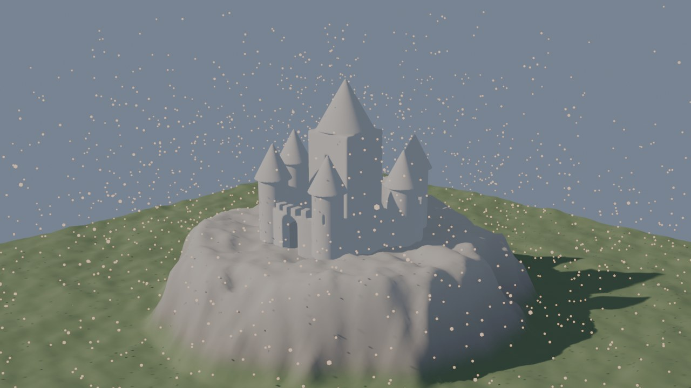
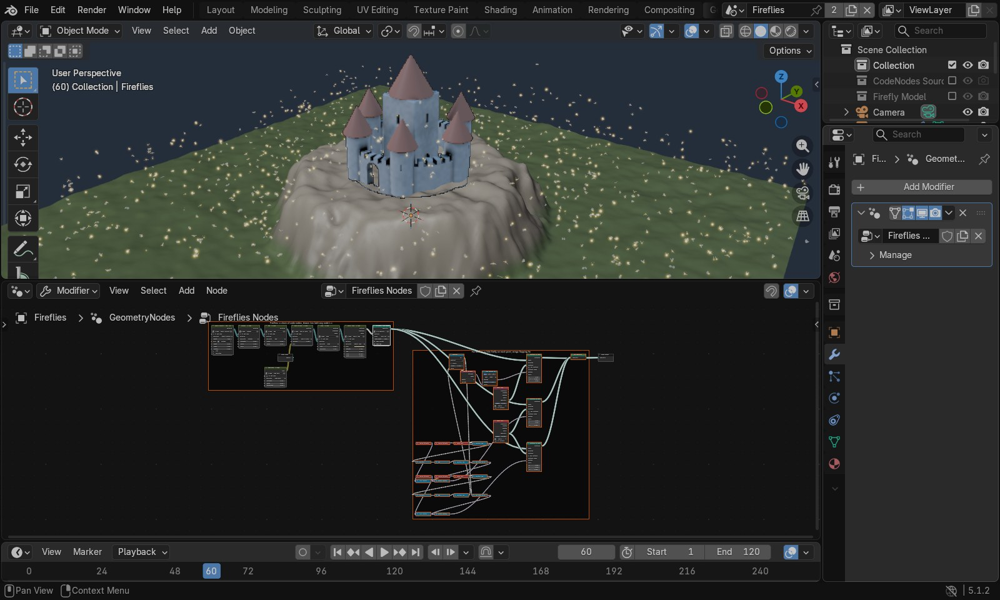
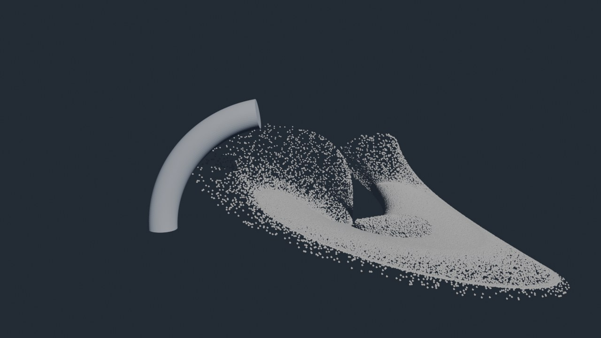
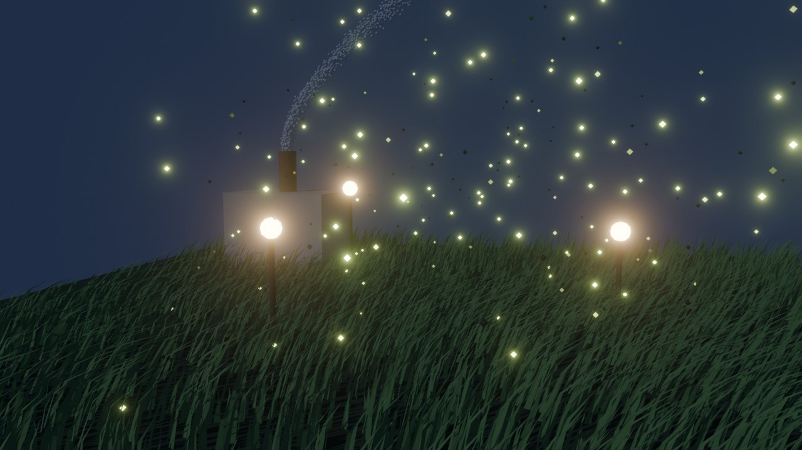
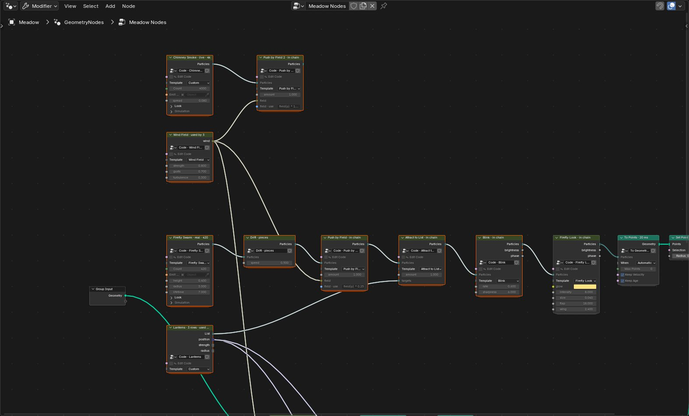
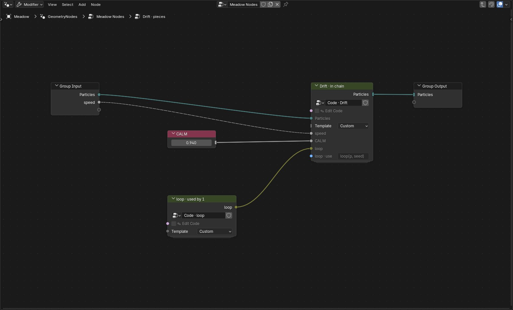
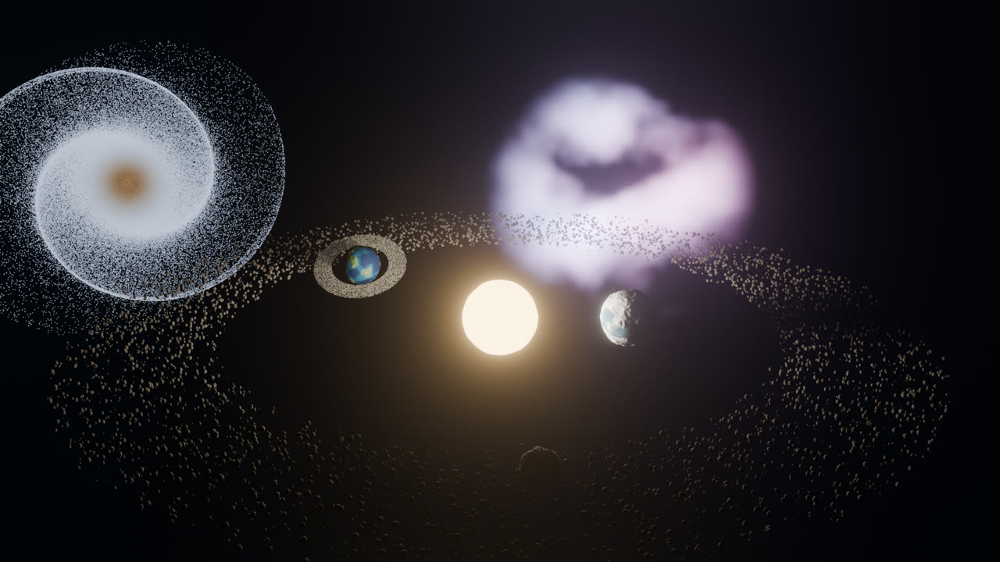
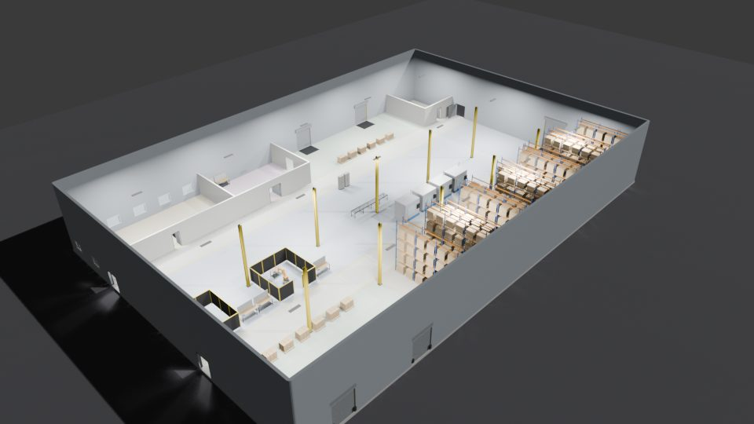

# CodeNodes

**Code nodes inside Geometry Nodes, running on the GPU.** Each code node is a node you write: its code
declares its own inputs and outputs, and you wire code nodes together like any other nodes. Each
chain compiles into one GPU program and draws live in the viewport:
- particle systems built from small nodes: a source, then behaviours, then a look (millions of
  particles)
- surfaces from distance functions, raymarched live
- code that runs on every vertex of a mesh, and warps that bend particles and meshes alike

**Code runs on the GPU by default, and one node makes it geometry.** Every code node runs and draws
on the GPU, live. Add **To Geometry** after a chain when you want ordinary Blender geometry: its
header reads **To Points** after particles and **To Mesh** after a surface or mesh chain. Then you can
instance on it, shade it, render it in EEVEE or Cycles, or export it. Nothing inserts it for you.

It also lets an assistant build, read and edit ordinary **Geometry Nodes** setups, and publish
scenes as interactive web pages.



*The demo scene (`examples/gpu_demo.py`), rendered with F12:*
- *a flat grid shaped into a plateau by a GPU Mesh node*
- *the Aerie citadel as a GPU Surface, raymarched live*
- *fireflies from a chain of six code nodes, with a little firefly model on each for the render*

> **Status: early (v0.3).** Everything listed as *works* is covered by tests on Blender 5.0.1 and
> 5.1.2, on Windows 11 with an NVIDIA GPU. Other platforms haven't been tried yet.
>
> **Licence: to be decided.** Until a licence file is added, please ask before reusing the code.

## Your first five minutes

After installing (see [Install](#install)), open the demo (build it with `examples/gpu_demo.py`, see
[Quick start](#quick-start)), or start fresh:

1. Select a mesh (a plane works), open the **Geometry Nodes** editor, and add
   **Shift A › CodeNodes › GPU Particles › Firefly Swarm**. Set its **Emit From** to the plane.
2. Add **Shift A › CodeNodes › Particle Stages › Wander**, **Rise** and **Blink**, and **Particle Looks › Firefly Look**. Wire each one's
   **Particles** output into the next one's **Particles** input. Fireflies appear in the 3D viewport:
   glowing, blinking, wings flapping, drawn straight from the GPU. The source's header says
   `Firefly Swarm · live · 2.5k`, and each stage says `in chain`.
3. Everything you can change is **on the nodes**: each node's sliders come from its code (`strength`,
   `climb`, `rate`, `size`, `flap`…), with the Template dropdown and settings panels beside them.
   **Hover over any socket** for a sentence saying what it does. The timeline doesn't need to play:
   with it paused the viewport keeps simulating, so dragging Wander's `strength` changes the motion
   straight away.
4. Switch on **✎ Edit Code**, a node's first input. Its code pops up in a Text Editor window, and the
   toggle switches itself back off. Double-clicking the node or pressing Ctrl+E does the same. Change
   the code and the fireflies follow as you type. A new `// @in float gust 1 0 5` line becomes a new
   input on the node; a new `// @out attr heat` line becomes a new output. End a line with a sentence
   in quotes (`// @in float gust 1 0 5  "How strong the gusts are"`) and that's its tooltip.
5. **Shift A › CodeNodes › To Geometry** after the last node turns the chain into real points (its
   header reads **To Points**),
   carrying `velocity`, `age` and each attribute the chain declares (Blink's `brightness` and
   `phase`). Wire them into Instance on Points, Set Material or anything else. Set its **When** to
   *Only for Render* to keep the live look in the viewport.
6. **F12** (or Render › Render Image) renders with the GPU nodes included; **Ctrl+F12** renders the
   animation, to the output path in its format (movies too).
7. Code nodes form a **graph**: wire Blink's **Particles** output into both Firefly Look and
   **Streak Look**, and you get glowing heads *and* trails from one simulation. **Join Particles**
   merges two streams; one **Wind Field** can push the fireflies and sway a grass mesh at once.
8. **Scene Lights** lights code nodes with your lamps and world; **Material Look** brings in a
   Blender material. **GPU Cache** bakes a simulation (⟳ Bake Now) and plays it back.

Every node, with its code and every socket, is in [docs/NODE_REFERENCE.md](docs/NODE_REFERENCE.md);
how graphs, baking and lighting work is in [docs/GPU_NODES.md](docs/GPU_NODES.md).

**The kinds of code node** (all in Shift A › CodeNodes, and in 3D View › Add › Mesh):

| Node | You write | Starters |
|---|---|---|
| **GPU Particles** | a source: `spawn(p)`, optionally `update(p, dt)` and `look(p)` | Galaxy, Flow, Attractor (from Myriad), Swirl, Fountain, Firefly Swarm, Spark Ball |
| **GPU Stage** | one step in a chain: `behave(p, dt)`, `born(p)`, `look(p)`, `warp(q)`, `deform(v)`, or functions for other nodes | Wander, Rise, Gravity, Vortex, Drag, Blink, Push by Field, Collide with Shape, Glow Look, Firefly Look, Streak Look, Material Look, Bend, Taper, Ripple, Sway by Field, Wind Field, Scene Lights |
| **Join Particles** / **GPU Cache** | nothing: flow nodes that merge two particle streams, or bake and play back a simulation | — |
| **GPU Surface (SDF)** | `float sdf(vec3 p)`, the distance to the surface; optional `vec3 color(vec3 p)` | Castle (from Aerie), Planet (Tellus-style), Saturn, Donut, Rounded Box, Gyroid Ball, Blob |
| **GPU Mesh** | `void deform(inout Vertex v)`, run on every vertex of the mesh wired into it | Wave, Noise Displace, Mesa, Twist |
| **Code Shape** | a small shape language (profiles, revolve, extrude, sweep); real geometry straight away | Desk Lamp, Vase |



**A node's sockets come from its code:**

```glsl
// @in  float amount 1.0 0 10      a slider           // @in  int   steps 2 1 8     a whole number
// @in  color tint 1 0.6 0.2       a colour           // @in  func  vec3 field(vec3 p)   a function input
// @out attr  heat 0.0             a per-particle value, readable by later nodes (and a field output)
// @out func  force                one of your functions, as an output socket
```

Particles travel on **Particles** sockets, meshes on Geometry sockets, functions on **Closure**
sockets, and attributes come out as float fields. Each node's names get their own prefix, so nodes
never clash. Compile errors name the node and the line you wrote. A **Bend** node works on particles
and meshes alike, and never changes the simulation: straighten it and the swirl is exactly as before.
[docs/GPU_NODES.md](docs/GPU_NODES.md) has the full syntax, how chains combine, the numbers, the limits,
and proposals for the rest of the starter library.



**Live, and converted.** A GPU chain on its own draws straight from GPU memory into the viewport:
- a million particles at about 190 fps
- the six-node firefly chain at about 150
- all depth-tested against your objects

That's a viewport picture: it isn't selectable, and later nodes can't see it. **To Geometry** turns
it into geometry.

**Rendering: just press F12.** Running GPU code while Blender renders crashes Blender, so when a
scene has GPU code nodes, F12, Ctrl+F12 and Render › Render Image / Render Animation take turns, for
each frame:
1. step the GPU chains to that frame
2. convert them (live-only chains just for the render)
3. render that frame, then move on

No bake is needed. Stills land in the Render window, animations are written to the output path in its
format (a movie is written from the rendered frames with Blender's own movie writer), and a scene
without GPU nodes gets Blender's own render. The Rendered viewport keeps drawing the live GPU nodes. A
preference (CodeNodes › "F12 and Render menu include GPU nodes") switches it off. For command-line or
farm renders, bake first.

**Tab into a code node** to see its code in a frame, and its full status or error in another. The
Node Editor sidebar (N) only has what Blender can't put on a node: an Edit Code button, an Add To
Geometry button, and the full error text.

**How a code node works under the hood.** Blender doesn't let add-ons define new nodes inside
Geometry Nodes, so a code node is an ordinary **Group node**, and its sockets are the group's inputs
and outputs. Each node you add (or duplicate with Shift D) gets its own code. Values that come in
through a link are followed back to a Value or Integer node, a reroute, or the modifier's own input.
A value computed by other nodes (Math, Scene Time, ...) is evaluated by a hidden helper and read
back, so it works too, frame by frame (a field is read at the origin).
**Make Native** replaces a GPU Surface node with real Geometry Nodes that do the same maths (needs
the ExpressNode add-on), so the file no longer needs CodeNodes at all.

**The separate CodeNodes node editor** (Sidebar › **New Node Graph**, or switch any Node Editor's
type to *CodeNodes*) combines several distance functions into one GPU program with Combine (union,
subtract, blend), Transform and Offset nodes. The starter graph makes a small Saturn.

## The modular workflow: the Windy Meadow

Pull a script apart, share the pieces, and let each node use them its own way.
`examples/meadow_demo.py` builds this scene and renders it with no window (Blender 5.2):



- **Use lines: one wind, three meanings.** One **Wind Field** is wired into three nodes, and its header
  says `used by 3`. Every function input has a use line under it saying how that node applies what's
  wired in. The grass's **Sway by Field** uses `vec3(field(p).xy, 0.0) * 1.4` (sideways only). The
  fireflies' **Push by Field** uses `field(p) * 0.25` (a gentle drift). The smoke's uses
  `field(p) * 1.2 + vec3(0.0, 0.0, amount * 0.4)` (it bends and rises). Type on the node or in the
  code: they stay in sync.
- **Lists: data on the graph.** **Lanterns** is a List node, a table of positions and pulls. The
  fireflies' **Attract to List** reads it in code (`targets(i).strength`), and native nodes read the
  same table (Get List Item → Points → Instance on Points) to stand a lantern on every row. Add a row
  and there's another lantern, with fireflies gathering round it.
- **Explode: a script's pieces as nodes.** **Drift** is exploded. Double-click (or Tab) into it like
  any node group: its `CALM` constant is a Value node and its `loop()` helper is a node of its own,
  both wired into what's left of Drift. Right-click › Collapse Into Code puts them back exactly.
  Any code nodes can be grouped with Ctrl+G too, and chains run straight through the group.





## On the web

Select an object with GPU particle chains and click **Export Live Web Page** in the sidebar: you get a
page that runs those chains in the browser (WebGL2), the same code that runs in your viewport, with each
node's sliders as page controls. Serve the folder (`python -m http.server`) and open it. For a whole site
built in Blender, WebBlend's **CodeNodes Live** target places it on a page next to text, images and video.

## A bigger example: the Galaxy

The firefly chain is one line of nodes. The Galaxy scene (`examples/galaxy_demo.py` builds it, and
`examples/galaxy_scene.py` is the code) shows what a *graph* of code nodes adds to Geometry Nodes: a
solar system in front of a spiral galaxy and a nebula, where the systems share functions and act on
each other. Select **Solar System** and its node tree shows four labelled frames:



1. **Shared Orbit: one node, many consumers.** The **Orbits** node has no stream. It gives out
   functions: `planetPos(i, t)`, `planetRadius(i)`, `planetMass(i)` and `planetCount()`. The planets'
   placement, the asteroids' gravity, their collisions and the ring all call those same functions.
   Pick **Figure Eights** in Orbits' Template dropdown and all of them follow the new paths at once:
   the planets trace figures of eight, the asteroids feel them in their new places, and the ring
   goes along.
2. **Reuse: one node, three planets.** Three **Planet Terrain** nodes (the same starter, a GPU Mesh)
   with different seeds and sea levels make a rocky world, an ocean world and an ice world. Each is
   painted by a **Colour by Height** node. It's the Mesa idea on a sphere, and yes, it combines with
   anything, because its input and output are ordinary geometry.
3. **Native + GPU: they take turns.** Ico Sphere (native) → Planet Terrain (GPU) → Colour by Height
   (GPU) → To Mesh → Set Material (native) → Geometry to Instance → Instance on Points (native). The
   points it instances on come from a GPU node, **Points from Function**, which places one point per
   planet with Orbits' `planetPos` and writes `bodySize` for Instance on Points' Scale.
4. **Interaction: systems act on each other.** An asteroid **Belt** runs through **Gravity to
   Bodies** (pulled by the star and every planet) and **Collide with Bodies** (bouncing off them; none
   ever ends up inside one), then To Points and Instance on Points turn it into lumpy rocks. A
   **Ring** of dust goes round the second planet through **Follow Body**.

Around it: a **Sun** (a GPU Surface lit by its own emission, with a real Point light parented to it,
so the real planets are lit), a **Galaxy** of a million stars coloured by temperature (**Star
Colours** writes a `temp` attribute that a Blackbody node uses in renders), and a **Nebula** (GPU
sprites live; a real volume from ordinary nodes, Volume Cube from noise, switched on for renders
with Is Viewport).

**Timing:** orbits use `uSceneTime`, the timeline's time. While the viewport previews a paused
scene, the asteroids keep moving, but the planets they orbit stay where the real planets are.

## What's in it

| Feature | What it does | Status |
|---|---|---|
| **Code → Mesh** (scripted object) | GLSL signed distance function → watertight quad mesh, sampled on the GPU | works |
| **Code → Shape** | a small shape language → exact, constructed meshes with sharp edges and real UVs | works |
| **Code → Volume** | GLSL density → OpenVDB volume that renders natively | works (script/API only, no panel yet) |
| **Code nodes you write** | a node's code declares its inputs (sliders, whole numbers, colours, functions) and outputs (streams, functions, per-particle attributes); sockets follow the code as you type | works |
| **Graphs of code nodes** | streams split into branches (branches that only differ in looks share one simulation), merge with Join Particles, and one function feeds any number of nodes; every path compiles into one GPU program; errors name the node and line | works |
| **GPU Cache** | bake a live particle simulation to disk (16-bit floats, compressed, next to the .blend) and play it back; Blender's own Bake node works after To Geometry too | works |
| **Scene Lights / Material Look** | your lamps, world and Blender materials on code nodes: lit looks for particles, and lit GPU Surfaces | works |
| **GPU Particles** | a particle source you write, drawn live (millions); Emit From another object's surface; To Geometry → points with velocity, age, life and the chain's attributes | works |
| **GPU Stage** | behaviours, looks (glow, fireflies with flapping wings), warps (Bend, Taper on particles and meshes), mesh stages, functions | works |
| **GPU Surface** | a distance function raymarched live in the viewport, lit, depth-tested with your objects; To Geometry → a watertight mesh | works |
| **GPU Mesh** | code run on every vertex of the mesh wired into it; To Geometry → the same topology with new positions, `color` and `value` | works |
| **To Geometry** | the node that turns a GPU node's result into real geometry: When (every frame / when changed / only for render), limits, attributes | works |
| **Rendering GPU nodes** | F12, Ctrl+F12 and the Render menu: GPU and renderer take turns per frame, no bake needed | works |
| **Everything on the node** | settings as node inputs (Template dropdown, count, colours, toggles), status in the header, ✎ Edit Code toggle opens a code pop-up | works |
| **Node editor** | code nodes with typed sockets that compile into one GPU program | works |
| **Bake to Disk** | animations written to files that play back with stock nodes; renders with no GPU and no add-on | works |
| **Bake to Nodes** | the GLSL itself becomes a Geometry Nodes network | experimental (needs the ExpressNode add-on, not public yet) |
| **Claude plugin (MCP + skill)** | Claude builds, renders and looks at its work in your open Blender; nothing to start in Blender; fixed tool list, no arbitrary code | works |
| **Geometry Nodes agent** | build, explain and edit any node tree as data; a library of tested capabilities (terrain, scatter, walls, rooms, roofs, stairs, water, paths) | works |
| **Web pages** | a scene as one self-contained page with sliders; Code Shapes rebuild live in the browser | works |
| **Buildings from a spec** | a written spec → floor plan → building → equipment → checks (factories, warehouses, simple houses) | experimental |
| **`geonodes/` library** | node-group assets and example scenes that open in plain Blender, no add-on needed | experimental |

## Requirements

- **Blender 5.0 or newer.**
- **A GPU and a Blender window** for the live GPU features (Code → Mesh, Volume, Particles). Background
  Blender (`-b`) has no GPU, so bake first for headless renders. Shapes, Geometry Nodes and the web
  export all work headless.
- **To use it with Claude:** Claude Code, and Python 3.10+ on the PATH (the MCP server uses the
  standard library only: nothing to install).

## Install

1. **Get the extension zip.** Download it from the Releases page once one is published, or build it
   from a clone of this repo:

   ```
   mkdir dist
   blender --command extension build --source-dir codenodes --output-dir dist
   ```

   That writes `dist/codenodes-0.1.2.zip` (Blender needs the `dist` folder to exist first).
2. **Install it.** Edit › Preferences › Get Extensions › the ⌄ menu at the top right ›
   **Install from Disk…** › pick the zip. It's enabled straight away.

## Use it with Claude

CodeNodes comes with a Claude Code plugin: an MCP server that drives the add-on, and a skill that
teaches Claude how to use it. Two commands, once:

```
claude plugin marketplace add quacktheplanet/CodeNodes
claude plugin install codenodes@codenodes
```

(While this work is on the `gpu-nodes` branch, add the branch:
`claude plugin marketplace add "quacktheplanet/CodeNodes#gpu-nodes"`.)

Then open Blender (with the add-on installed) and ask Claude for something: *"use CodeNodes to make a
vase with a wavy rim and render it"*, or *"make a donut code node and wire three copies into a
Join"*. There's nothing to start or copy in Blender: the add-on lets assistants on this computer
connect by itself, and the MCP server finds the open Blender (or lets Claude pick one when several
are open).

- **Turning it off:** Edit › Preferences › Add-ons › CodeNodes › **Let assistants connect**.
- **Only this computer can connect.** The link listens on 127.0.0.1 and checks a random token that
  Blender writes to `~/.codenodes/` for the MCP server to read. It doesn't start in background
  (`-b`) Blender.
- **Fixed tool list.** The add-on answers only the names in its own tool table; there is no tool
  that runs arbitrary code in Blender.
- **Without the plugin:** any MCP client can run the server directly:
  `claude mcp add codenodes -- python path/to/CodeNodes/mcp/run_server.py`.

## Quick start

| To try | Do this |
|---|---|
| GPU Particles | Geometry Nodes › Shift A › CodeNodes › **GPU Particles › Galaxy** (or Flow, Attractor…), wired to the output; play the timeline. |
| GPU Surface | Shift A › CodeNodes › **GPU Surface › Castle**; add **To Geometry** after it for a real mesh. |
| GPU Mesh | Wire any mesh into Shift A › CodeNodes › **GPU Mesh › Wave**, then **To Geometry** for the modified mesh. |
| The demo scene | `blender --factory-startup --window-geometry 0 0 1600 960 --python examples/gpu_demo.py -- out` builds `out/codenodes_demo_v3.blend` (a Fireflies scene and a Bend scene) and renders it. |
| Code → Shape | Add › Mesh › **Code Shape**. Sliders appear on the node for every `param` line. |
| Code → Volume | From the Python console: `from bl_ext.user_default.codenodes import api, volume` then `api.code_to_volume(volume.TEMPLATE, name="Smoke")`. |
| Node editor | Open a Node Editor and switch its type to **CodeNodes** (or Sidebar › CodeNodes › **New Node Graph**). |
| Geometry Nodes capabilities | From a clone of this repo: `blender -b --factory-startup --python examples/village_demo.py -- out` builds and renders the village above into `out/`. |
| Web page with sliders | `blender -b --factory-startup --python examples/web_simple.py -- courtyard.html`, then open the page in a browser. |
| The library without the add-on | Open anything in [`geonodes/`](geonodes/) in plain Blender (see its README). |

The examples run straight from a clone (they load CodeNodes from the repo, no install needed) and
are listed in [examples/README.md](examples/README.md). Everything below goes into
each feature in more detail.

## Code → Mesh

Write a signed distance function (negative inside, positive outside). CodeNodes samples it on the
GPU and builds a real, watertight quad mesh.

```glsl
// @param radius 1.0 0.2 2.0
// @param thickness 0.3 0.05 0.8
float sdf(vec3 p) {
  return smin(sdTorus(p, radius, thickness), sdSphere(p, 0.6), 0.4);
}
```

Each `// @param name default min max` line becomes a slider. Your slider values are kept when the
code changes, so an assistant can rewrite the code without resetting what you tuned. **Live**
rebuilds as you edit; **Animate** rebuilds every frame, with the time in `uTime`.

## Code → Shape

Maths turned into a model that is *constructed* rather than sampled. Declare sliders, describe a 2D
profile, then spin or push it:

```
param height  0.34  0.10 0.80   # Height of the lamp
param radius  0.14  0.03 0.40

part shade
  profile
    move  radius * 0.38, height
    curve x = radius * (0.38 + 0.62 * t)  y = height - height * 0.22 * t  steps 20
  revolve segments 72
```

Every number can be maths, so the whole object is one formula. Because the mesh is built rather
than marched, **edges land exactly where the maths puts them, corners stay sharp, the quads follow
the form, and the UVs mean something**: good for lamps, bottles, columns, walls and anything turned
or extruded. Add › Mesh › **Code Shape**, or `api.code_to_shape(source)`.

| command | what it does |
|---|---|
| `param name default min max  # tooltip` | a slider (a comment at the end of the line is its tooltip) |
| `part name [add\|subtract\|intersect]` | a piece, and how it combines with the others |
| `profile` › `move` `line` `arc` `curve` `close` `shell` | a 2D outline; `shell` gives an open one thickness |
| `path` › `move` `line` `curve` `helix` | a 3D route to carry a profile along |
| `revolve` `extrude` `sweep` `loft` | turn the profile(s) into a solid |
| `translate` `rotate` `scale` `array` | place and repeat it: `translate 0, 0, 1` or just `translate z 1`, `rotate x 90`, `scale 2` (even) or `scale z 2` |
| `bevel width segments n` | round the sharp edges |
| `finish` | a last block: `bevel`, `smooth`, applied to the whole thing |

Functions: `sin cos tan asin acos atan atan2 sqrt abs sign floor ceil round exp log pow min max mod
hypot clamp mix smoothstep radians degrees`, plus `pi`, `tau`, `e`, and `t` inside a `curve`.

`subtract` lets one part cut another (a hole drilled through a block), `sweep` along a `helix`
makes springs and screw threads (a path that ends where it starts, such as a full turn with no
pitch, joins into a ring with no end caps), and `loft` blends one profile into another. **Profile as Curve**
draws the outlines as a real curve object, which is far easier to judge by eye than a column of
numbers.

It is a language CodeNodes parses itself, not Python, so a description from anywhere is safe to
build.

## Code → Volume

Write a density instead of a distance and get smoke, cloud or nebula geometry that EEVEE and Cycles
render natively:

```glsl
// @param scale 1.6 0.2 6.0
float density(vec3 p) {
  return clamp(1.0 - length(p) / 1.6 + 0.5 * (fbm3(p * scale) - 0.55), 0.0, 1.0);
}
```

```python
api.code_to_volume(source, name="Smoke", resolution=96)                    # one frame
api.code_to_volume(source, name="Smoke", frame_start=1, frame_end=48)      # a .vdb sequence
```

Volumes are written as OpenVDB files, so a sequence plays back natively with no add-on and no GPU.

## Code → Particles

Write the solver yourself. `spawn` places a particle, `update` moves it, and CodeNodes keeps the
state on the GPU and steps it as the frame changes:

```glsl
// @param speed 1.0 0.0 4.0
void spawn(inout Particle p) {
  p.position = randBall(p.seed) * 1.8;
  p.life = 4.0 + rand1(p.seed * 3.3) * 3.0;      // then it respawns
}
void update(inout Particle p, float dt) {
  p.velocity = vec3(-p.position.y, p.position.x, 0.2) * speed;  // your own field: a swirl
  p.position += p.velocity * dt;
}
```

`Particle` carries `position`, `velocity`, `age`, `life` and a per-particle `seed`. The points come
out as a real point cloud with `velocity`, `speed`, `age` and `life` attributes, so Geometry Nodes
can instance anything onto them and Cycles uses `velocity` for motion blur. (The Add › Code
Particles template shows a curl-noise field written the same way.) Shade with **`speed`**, not
`velocity`: Blender reserves that name for motion blur and a shader can't read it back.
Add › Mesh › **Code Particles**, or `api.code_to_particles(source, name="Swirl", count=20000)`.

300,000 particles simulate in about 12 ms per frame on an RTX A4500.

## From a script

```python
from bl_ext.user_default.codenodes import api      # the extension's module path
api.code_to_mesh(source, name="Ring", resolution=128)
# {"ok": True, "faces": 18432, ...}, or {"ok": False, "error": "line 3: undefined variable 'lenght'"}
api.set_params("Ring", radius=1.4)
print(api.reference())                             # the helper functions available in GLSL
```

Errors never raise. They come back with the line number in *your* code, so a caller can fix the code
and try again.

## Node editor

Open a Node Editor and switch its type to **CodeNodes** (or View3D › Sidebar › CodeNodes ›
**New Node Graph** for a starter graph).

| node | does |
|---|---|
| **SDF Code** | code in a Text block; each `@param` line becomes an input socket |
| **Combine** | Union, Subtract, Intersect, Smooth Union, Smooth Subtract (blend width K) |
| **Transform** | move, rotate, scale a shape |
| **Offset** | grow or shrink a shape |
| **Mesh Output** | Code → Mesh: target object, resolution, bounds, Live, Animate |
| **Particles** | a solver in code; its `@param` lines become input sockets |
| **Points Output** | simulates and shows the points on an object, with the same Live / Animate / Bake |
| **Shape** | a parametric description; its `param` lines become input sockets |

The whole graph compiles into one GPU program. Each code node's functions and parameters get a
per-node prefix, so two nodes can both define `bump()`. A compile error names the node and the line
inside it, and that node shows the error too. Reroutes and muted nodes pass shapes through, and
graphs can have up to 256 sliders.

## Driving it from an assistant

`codenodes.agent` is the surface an assistant works through. Every call returns a plain dict and
never raises for a fixable mistake, so a model can read the error, fix its code and try again:

```python
from bl_ext.user_default.codenodes import agent
agent.help()                                   # the kinds, the GLSL helpers, a template for each
agent.make("mesh", code, name="Ring")          # or "particles" / "volume" / "shape"
agent.set_params("Ring", radius=1.4)
agent.look_at("Ring"); agent.light("studio")   # frame it, light it
agent.render()                                 # -> {"path": "...png"} to open and look at
agent.scene()                                  # what exists, with each object's kind and sliders
agent.bake("Ring", 1, 48)
```

`look_at` and `light` exist because a render with no camera aim or lighting comes out black, which
wastes a whole round trip.

**Over MCP.** `mcp/` is an MCP server (standard library only) that exposes those functions to an
assistant, so it can build something, render it and look at what it made; the Claude Code plugin
runs it for you (see [Use it with Claude](#use-it-with-claude)). It only accepts connections from
this computer and **has no way to run arbitrary code in Blender**: the add-on answers only the names
in its own tool table. See [mcp/README.md](mcp/README.md).

## Geometry Nodes, built and edited by an assistant


*Terrain with a canyon, a trail that turns into a bridge where it crosses, a walled courtyard that
follows the ground, a forest that keeps clear of both, lamps along the trail, and the trees and
lamps modelled in the shape language. Every step was one tool call:
[`examples/level_demo.py`](examples/level_demo.py). Built in under a second, rendered in 11.*

`codenodes.gn` lets an assistant work with ordinary Geometry Nodes: build a setup, understand one
that already exists, and change part of it without disturbing the rest.

**A library of tested capabilities** to compose rather than write from nothing. Each is an ordinary
node group with its controls as modifier sliders, seeded so the same seed gives the same result:

| capability | what it does |
|---|---|
| `terrain` | rolling ground from noise; an optional winding canyon; rock on anything steeper than Cliff Angle |
| `scatter` | trees, rocks, props over a surface, kept off steep slopes and clear of paths and buildings, picked from a collection |
| `wall` | a solid wall along a curve with doorways and posts; follows uneven ground and stays vertical |
| `path_bridge` | a walkway that hugs the ground and becomes a bridge (railings, posts, pillars) wherever the ground falls away |
| `along_curve` | things beside a curve at a spacing (lamps, benches): one side, both, or alternating |
| `wall_network` | walls along every spline of a curve, joined into one solid at corners, T's and crossings; doorways that keep off the junctions |
| `rooms` | a floor plan of closed outlines → floors, walls joined where rooms touch, one doorway between each pair of rooms, windows along outside walls, an entrance |
| `roof` | flat, gable or hip (equal pitch all round) with an overhang, stacked after `rooms` on the same object |
| `stairs` | stairs (even steps no taller than Step Height) or a ramp along a curve, between its two end heights, solid to the ground, optional side walls |
| `water` | a water surface along a curve, and terrain's **Carve** inputs, which cut a riverbed (or flatten a road) along a curve and ease the banks back |


*A house from a three-room floor plan with a hip roof, a yard of walls meeting at a T and two corners
on uneven ground, stairs, and a river carved into the terrain:
[`examples/village_demo.py`](examples/village_demo.py).*

```python
agent.curve("Trail", [[-9, -44, 1], [0, -8, 1.6], [12, 44, 1]])
agent.nodes_use("path_bridge", "Trail", {"Ground": "Ground", "Gap Depth": 1.2})
agent.nodes_set_inputs("Trail", {"Width": 3.0})          # later: "make it wider"

agent.curve("House", splines=[[[0, 0], [7, 0], [7, 5], [0, 5]],     # rooms share corners
                              [[7, 0], [11, 0], [11, 5], [7, 5]]], cyclic=True, smooth=False)
agent.nodes_use("rooms", "House", {"Entrance": 0})
agent.nodes_use("roof", "House", {"Style": 2})             # the next modifier: sits on the walls
```

**Any node setup, as data, both ways.** The catalog is read out of Blender itself (about 320 node
types) and says for every socket **whether it can take a field or only a single value** (the most
common way a setup goes wrong) and, for Blender 5's menu sockets, what the choices are.

```python
agent.nodes_find("distribute points")     # what exists, and exactly what it takes
agent.nodes_write(description)            # build a tree from plain data; sockets named plainly
agent.nodes_explain("MyGroup")            # an existing tree in words, in flow order
agent.nodes_edit("MyGroup", [{"op": "insert", "node": {...}, "between": {...}}])
agent.nodes_check("MyGroup")              # what came out: mesh, curves, points, instances, size
```

- **The round trip is lossless**, including the parts that usually break: nodes whose sockets you
  add yourself (Capture Attribute, Repeat and Simulation zones, Menu and Index Switch), whose socket
  identifiers are *not* stable across a rebuild; groups inside groups; panels.
- **Edits are all or nothing** (tried on a copy first) and keep the group's socket identifiers, so
  values tuned on the modifier survive.
- **Mistakes are explained in terms of the node**: *"'Value' is a field (it varies per element) but
  'Vertices X' on 'grid' takes a single value"*, or *"'grid' has no input 'Sise'. It has: Size,
  Vertices X…"*.

The same tools are MCP tools, alongside `material`, `collect`, `curve`, `light("outdoor")`,
`look_at` and `render`, so an assistant can build a scene, look at it and fix what it sees.

## Buildings from a spec (experimental)

"Make me a 60 x 40 m factory floor with docks, racking, machining, two robot cells, QA and offices"
becomes a spec (spaces with areas, closeness ratings, material flow, equipment), and six tools do the
rest:

```python
agent.plan_site(spec, name="Plant")      # or example="factory"; a plan, a text grid, a picture
agent.edit_plan("Plant", [{"op": "swap", "a": "QA", "b": "Offices"}])
agent.build_plan("Plant")                # walls with every door and dock cut, roof, columns, lights
agent.place_equipment("Plant")           # conveyors, fenced robot cells, rack rows, machine rows
agent.verify("Plant")                    # collisions, aisles, egress walk, reach, floating parts,
                                         # openings, mesh intersections; renders three views
agent.assets("robot_arm")                # a generator's sliders, clearances and joints
```

The same six are MCP tools. Everything is built from the Geometry Nodes library and 17 parametric
generators. It's a first pass: layouts are sensible and every check passes, but the equipment is
simple and blocky and house plans come out boxy. How it works and why:
[docs/MODELING_RESEARCH.md](docs/MODELING_RESEARCH.md).



## To the web, with sliders

`agent.web_page` writes a scene as one self-contained page (three.js, orbit controls) with a slider
for any modifier input, and it runs headless:

```python
agent.web_page("level.html", title="Canyon Crossing", sliders=[
    {"object": "Courtyard", "input": "Doorways", "values": [0, 1, 2, 3, 4]},
    {"object": "Trail", "input": "Gap Depth", "values": [1.2, 4, 20], "unit": "m"}])
```

Geometry Nodes can't run in a browser, so every slider position is built in Blender first and
exported as glTF. Each slider is tried at every value to find what it *really* changes, and sliders
that change the same objects are baked as combinations, so the page never shows a mix that couldn't
exist. [`examples/web_demo.py`](examples/web_demo.py) turns the level above into a 5.8 MB page with
four sliders, and [`examples/web_simple.py`](examples/web_simple.py) makes a small one.

**Code Shapes go live instead.** A shape is written in CodeNodes' own small language, so the browser
can build it itself: `agent.web_shape` (MCP `web_shape`) writes a page carrying the shape's text and
a JavaScript copy of the builder, and every slider rebuilds the mesh as it moves, at any value.
Nothing is baked, and the page is about 60 KB. The lamp rebuilds in 5–10 ms.

```python
agent.make("shape", TEMPLATE, name="Lamp")
agent.web_shape("lamp.html", object="Lamp", colors={"shade": [0.9, 0.55, 0.2]})
```


The JavaScript (`codenodes/shapes/shapes.js`) is a line-for-line port, and `tests/test_shape_js.py`
holds it to the Python: every command, at several slider values, gives the same vertices to float32
precision and the same faces in the same order. Parts that cut other parts (`subtract`, `intersect`)
need Blender's boolean solver, so those shapes are refused (bake them with `web_page`); bevels are
left off.

The `web/` folder has a few standalone graphics showcases (a raymarched citadel, a procedural planet,
a million-particle simulation, a raster flythrough, a mesh editor) made alongside CodeNodes; open
them in a browser with WebGL2. Two of them load three.js from a CDN, so they need an internet
connection.

## Animation, and making it render

There are three phases.

1. **Live.** Turn on **Animate** and the mesh rebuilds on every frame change, using `uTime`. This is
   for working, not for rendering: running GPU code from a frame handler during an F12 render crashes
   Blender, and background Blender has no GPU at all.
2. **Baked.** Press **Bake to Disk**, pick a frame range, and CodeNodes writes one file per frame next
   to your .blend and builds a small node group (Scene Time → Format String → Import PLY) that plays
   it back. From then on it's ordinary Geometry Nodes geometry: it renders in F12, on a machine with no
   GPU and without this add-on. **Remove Cache** goes back to live.
3. **Bake to Nodes (experimental).** The code itself becomes a Geometry Nodes network: no files, no
   GPU, evaluated natively every frame, sliders on the modifier. CodeNodes translates the GLSL into
   the language of ExpressNode (a separate add-on, not public yet), which builds the node group;
   a Volume Cube (density = −sdf) and Volume to Mesh make the surface. Tested against the GPU mesh from
   the same code: the same vertices, after a slider change and on an animated frame. About 8 ms per
   rebuild at resolution 96.

   What translates: local variables, maths, `?:`, your own helper functions and CodeNodes' distance
   helpers (`sdSphere`, `sdBox`, `smin`, `rotateZ`…), `uTime`/`uFrame`. Loops, `if` statements and
   `noise3`/`fbm3` don't yet: the button says which line and suggests Bake to Disk.

```python
api.bake("Blob", 1, 48)     # to disk
api.bake_to_nodes("Ring")   # to nodes: {"ok": True, "sliders": [...]} or {"ok": False, "error": "line 9: a loop...", "fallback": "bake"}
```

## What keeps it from crashing

- A shader that doesn't compile is a message, not a crash. The driver's log is captured and mapped
  back to your line numbers.
- The GPU only samples the grid; the meshing is pure numpy. One slice is timed first, and code that
  would take too long is refused before it can stall the GPU. Work runs in short slabs.
- Resolution (8–512), memory (1 GiB) and texture size are checked before anything runs.
- A new mesh is built on the side and swapped in only when everything succeeded, so a failed build
  leaves the object as it was. Materials and modifiers carry over, and old mesh data is freed.
- Animate is skipped while a render job runs.
- Rebuilding a node (a new template, a code edit that changes its sockets) never keeps Python
  references to Blender data across the rebuild: users are saved and re-found by name. And before any
  error is printed, Blender structs are taken off it, because Python's "Did you mean …?" suggestion
  calls dir() on them, which crashes Blender when the struct was just freed (this was a real crash on
  switching templates).

## Known limitations

- **Tested on Windows only** (Windows 11, NVIDIA RTX A4500, OpenGL). macOS, Linux and other GPUs
  haven't been tried.
- GPU code (Code → Mesh, Volume, Particles) needs Blender with a window. Bake first for headless renders.
- Code → Volume has no node or panel yet; it's used from scripts and the assistant.
- Surface nets rounds off sharp edges and corners slightly. For crisp edges, use Code → Shape.
- Baked file paths are absolute, so moving a .blend with a bake breaks its playback. A relative-path
  mode is planned.
- Roofs cover a plan's bounding box; L- and T-shaped plans don't get proper roofs yet.
- Buildings from a spec and the `geonodes/` library are experimental (see above).
- Bake to Nodes needs the ExpressNode add-on, which isn't public yet.
- GPU nodes and Blender objects don't shadow each other, and the live additive glow isn't tone-mapped
  in the Solid viewport (dense glow can clip to white).

## Tests

```bash
python tests/test_mesher.py                                    # mesher, no Blender (17 checks)
python tests/test_graph.py                                     # graph compiler, no Blender (16)
python tests/test_shapes.py                                    # maths, the kernel, the language (98)
python tests/test_shape_js.py                                  # the browser's copy builds exactly what Python does (23)
python tests/test_rpc.py                                       # the MCP wire protocol, and the MCP server matches the add-on (31)
python tests/test_factory.py                                   # spec, planner, generators, layout, verifier, edits (129)
blender --factory-startup --python tests/test_blender.py       # needs a window: the GPU isn't available with -b (29)
blender --factory-startup --python tests/test_nodes.py         # node editor, incl. save/reload (30)
blender --factory-startup --python tests/test_bake.py          # baking, and playback through stock nodes (18)
blender --factory-startup --python tests/test_bake_nodes.py    # code to nodes, against the GPU mesh (11; needs ExpressNode)
blender -b --factory-startup --python tests/test_farm.py       # the bake renders with no GPU and no add-on (10)
blender --factory-startup --python tests/test_volume.py        # density code -> OpenVDB -> Volume object (16)
blender --factory-startup --python tests/test_particles.py     # GPU particle solver, incl. baking (22)
blender --factory-startup --python tests/test_agent.py         # the assistant-facing surface (31)
blender --factory-startup --python tests/test_live_preview.py  # template switching stress, safe errors, the paused preview (11)
blender --factory-startup --python tests/test_shape_blender.py # shapes as Blender objects (36)
blender --factory-startup --python tests/test_server.py        # a real socket client against Blender (26)
blender -b --factory-startup --python tests/test_gn.py         # Geometry Nodes as data, both ways (60)
blender -b --factory-startup --python tests/test_gn_library.py # every capability; editing real trees (72)
blender -b --factory-startup --python tests/test_web.py        # a scene as a web page with sliders; a live shape page (16)
blender -b --factory-startup --python tests/test_factory_blender.py   # building, equipment, scene checks, house (30)
blender -b --factory-startup --python tests/test_geonodes_library.py  # geonodes/ in plain Blender, no add-on (15)
node tests/web_shape_check.mjs <page folder>                   # a live shape page in headless Edge (7; needs puppeteer-core)
powershell -File tests/install_check.ps1 -Python <venv python> -Work <scratch folder> -Blenders <blender.exe>,...
    # the zip installed as a user installs it, then the whole loop through the real MCP process (29 per version)
```

Run `test_bake.py` before `test_farm.py`: the first saves the .blend the second opens. The
windowed tests quit by themselves when they finish. Test output goes to your temp folder, not the
repo.

## Project layout

| Folder | What's there |
|---|---|
| `codenodes/` | the Blender extension (the part you install) |
| `mcp/` | the MCP server that connects an assistant to the extension |
| `geonodes/` | node-group assets and example scenes that need no add-on |
| `examples/` | scripts that build the demo scenes and pages |
| `web/` | standalone browser showcases |
| `docs/` | roadmap, research notes and images; start at [docs/README.md](docs/README.md) |
| `tests/` | the test suites above |

## Licence

To be decided. Until a licence file is added, the code is not licensed for reuse; please ask first.
