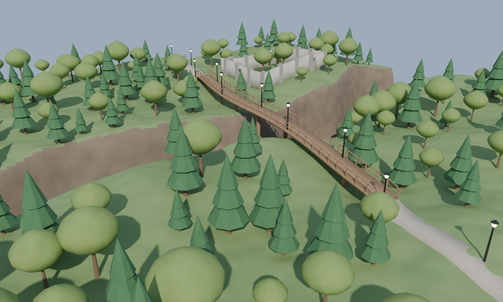
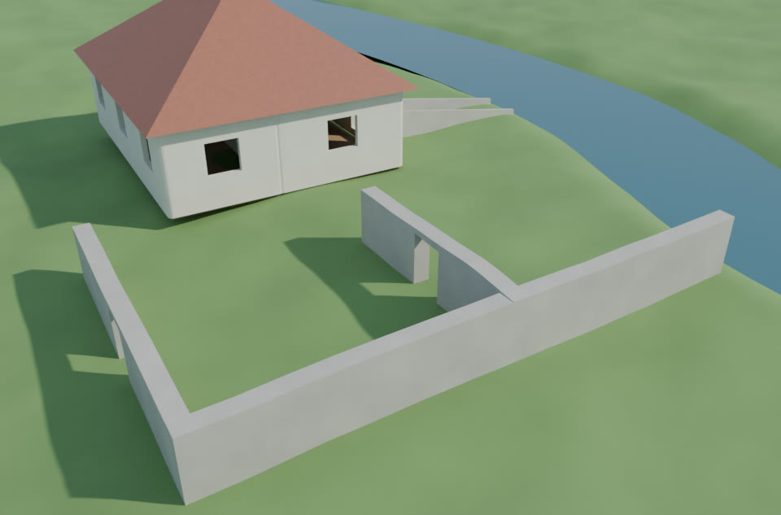
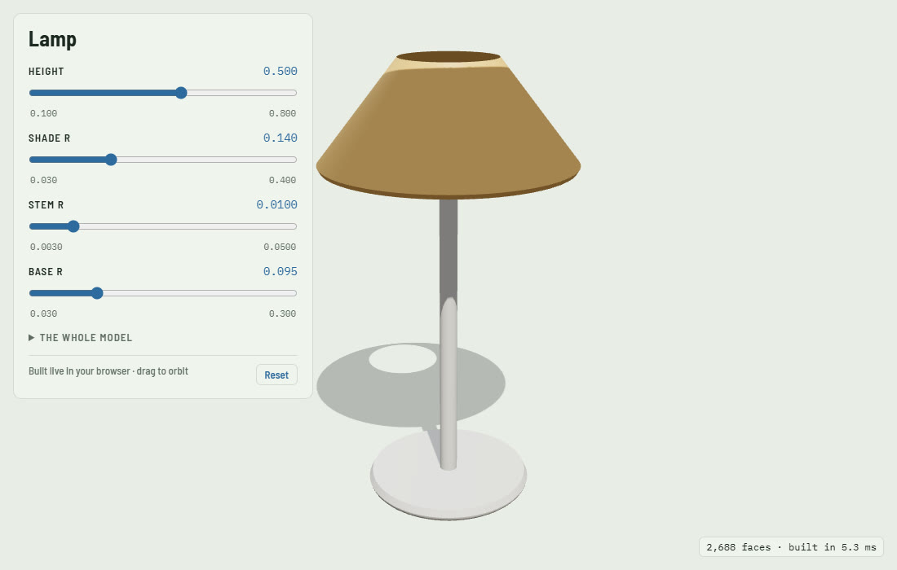

# CodeNodes

GPU code inside Blender. You (or Claude) write a small piece of GLSL, and CodeNodes runs it on the GPU
and turns the result into something Blender can use.

**First piece: Code → Mesh.** Write a signed distance function (negative inside, positive outside),
and CodeNodes samples it on the GPU and builds a real, watertight quad mesh. You can light it, render
it with EEVEE or Cycles, sculpt it, add modifiers or export it.

```glsl
// @param radius 1.0 0.2 2.0
// @param thickness 0.3 0.05 0.8
float sdf(vec3 p) {
  return smin(sdTorus(p, radius, thickness), sdSphere(p, 0.6), 0.4);
}
```

Each `// @param name default min max` line becomes a slider. Your slider values are kept when the code
changes, so Claude can rewrite the code without resetting what you tuned.

**Code → Shape.** Maths turned into a model that is *constructed* rather than sampled. Declare
sliders, describe a 2D profile, then spin or push it:

```
param height  0.34  0.10 0.80
param radius  0.14  0.03 0.40

part shade
  profile
    move  radius * 0.38, height
    curve x = radius * (0.38 + 0.62 * t)  y = height - height * 0.22 * t  steps 20
  revolve segments 72
```

Every number can be maths, so the whole object is one formula. Because the mesh is built rather
than marched, **edges land exactly where the maths puts them, corners stay sharp, the quads follow
the form, and the UVs mean something** — what you want for lamps, bottles, columns, walls and
anything turned or extruded. Add › Mesh › **Code Shape**, or `api.code_to_shape(source)`.

| command | what it does |
|---|---|
| `param name default min max` | a slider |
| `part name [add\|subtract\|intersect]` | a piece, and how it combines with the others |
| `profile` › `move` `line` `arc` `curve` `close` `shell` | a 2D outline; `shell` gives an open one thickness |
| `path` › `move` `line` `curve` `helix` | a 3D route to carry a profile along |
| `revolve` `extrude` `sweep` `loft` | turn the profile(s) into a solid |
| `translate` `rotate` `scale` `array` | place and repeat it |
| `bevel width segments n` | round the sharp edges |
| `finish` | a last block: `bevel`, `smooth`, applied to the whole thing |

Functions: `sin cos tan asin acos atan atan2 sqrt abs sign floor ceil round exp log pow min max mod
hypot clamp mix smoothstep radians degrees`, plus `pi`, `tau`, `e`, and `t` inside a `curve`.

`subtract` lets one part cut another (a hole drilled through a block), `sweep` along a `helix`
makes springs and screw threads, and `loft` blends one profile into another. **Profile as Curve**
draws the outlines as a real curve object, which is far easier to judge by eye than a column of
numbers.

It is a language we parse ourselves, not Python — so a description from anywhere is safe to build.

**Code → Volume.** Write a density instead of a distance and get smoke, cloud or nebula geometry that
EEVEE and Cycles render natively:

```glsl
// @param scale 1.6 0.2 6.0
float density(vec3 p) {
  return clamp(1.0 - length(p) / 1.6 + 0.5 * (fbm3(p * scale) - 0.55), 0.0, 1.0);
}
```

```python
api.code_to_volume(source, name="Smoke", resolution=96)                    # one frame
api.code_to_volume(source, name="Smoke", frame_start=1, frame_end=48)      # a .vdb sequence
```

Volumes are written as OpenVDB files, so a sequence plays back natively with no add-on and no GPU.

**Code → Particles.** Write the solver yourself. `spawn` places a particle, `update` moves it, and
CodeNodes keeps the state on the GPU and steps it as the frame changes:

```glsl
// @param speed 1.0 0.0 4.0
void spawn(inout Particle p) {
  p.position = randBall(p.seed) * 1.8;
  p.life = 4.0 + rand1(p.seed * 3.3) * 3.0;      // then it respawns
}
void update(inout Particle p, float dt) {
  p.velocity = vec3(-p.position.y, p.position.x, 0.2) * speed;  // your own field: a swirl
  p.position += p.velocity * dt;
}
```

`Particle` carries `position`, `velocity`, `age`, `life` and a per-particle `seed`. The points come
out as a real point cloud with `velocity`, `speed`, `age` and `life` attributes, so Geometry Nodes
can instance anything onto them and Cycles uses `velocity` for motion blur. (The Add › Code
Particles template shows a curl-noise field written the same way.) Shade with **`speed`**,
not `velocity`: Blender reserves that name for motion blur and a shader cannot read it back.
Add › Mesh › **Code Particles**, or `api.code_to_particles(source, name="Swirl", count=20000)`.

300,000 particles simulate in about 12 ms per frame on an RTX A4500.

## Install it in your Blender

Tested exactly this way in throwaway profiles on Blender 5.0.1 and 5.1.2 (`tests/install_check.ps1`).

1. **Build the extension zip** (from this folder; `dist/` is not in git, so build a fresh one):

   ```
   blender --command extension build --source-dir codenodes --output-dir dist
   ```

   That writes `dist/codenodes-0.1.0.zip`.
2. **Install it.** Edit › Preferences › Get Extensions › the ⌄ menu at the top right ›
   **Install from Disk…** › pick the zip. It is enabled straight away.
3. **Start the assistant link.** 3D Viewport › Sidebar (N) › **CodeNodes** › **Assistant** ›
   **Start**. Blender writes a token to its config folder; nothing is reachable from the network.
4. **Install the MCP server once**, in its own Python (3.10 or newer; MCP SDK 1.x and 2.x both
   work):

   ```
   python -m venv %USERPROFILE%\codenodes-mcp
   %USERPROFILE%\codenodes-mcp\Scripts\pip install -e path/to/CodeNodes\mcp
   ```
5. **Tell Claude Code about it:**

   ```
   claude mcp add codenodes -- %USERPROFILE%\codenodes-mcp\Scripts\codenodes-mcp.exe
   ```

   (With `uv` installed, `claude mcp add codenodes -- uvx --from path/to/CodeNodes/mcp codenodes-mcp`
   works too.)
6. **Try it:** ask Claude to "use CodeNodes to make a wall with two doorways along an L-shaped
   curve, then render it". It should build it, render it and describe what it sees.

The server only runs while Blender is open and you have pressed Start. To update CodeNodes later,
build a new zip and install it over the old one.

## Use it

- **In Blender:** Add › Mesh › **Code Mesh**, then View3D › Sidebar (N) › **CodeNodes**. The code
  lives in a Text block; edit it and the mesh rebuilds (Live). **Animate** rebuilds every frame, with
  the time in `uTime`.
- **From a script or Claude** (through any Blender MCP that runs Python):

  ```python
  from codenodes import api          # installed as an extension: from bl_ext.user_default.codenodes import api
  api.code_to_mesh(source, name="Ring", resolution=128)
  # {"ok": True, "faces": 18432, ...}, or {"ok": False, "error": "line 3: undefined variable 'lenght'"}
  api.set_params("Ring", radius=1.4)
  print(api.reference())             # the helper functions, for Claude
  ```

  Errors never raise. They come back with the line number in *your* code, so a caller can fix the
  code and try again.

## Node editor

Open a Node Editor and switch its type to **CodeNodes** (or View3D › Sidebar › CodeNodes ›
**New Node Graph** for a starter graph).

| node | does |
|---|---|
| **SDF Code** | code in a Text block; each `@param` line becomes an input socket |
| **Combine** | Union, Subtract, Intersect, Smooth Union, Smooth Subtract (blend width K) |
| **Transform** | move, rotate, scale a shape |
| **Offset** | grow or shrink a shape |
| **Mesh Output** | Code → Mesh: target object, resolution, bounds, Live, Animate |
| **Particles** | a solver in code; its `@param` lines become input sockets |
| **Points Output** | simulates and shows the points on an object, with the same Live / Animate / Bake |
| **Shape** | a parametric description; its `param` lines become input sockets |

The whole graph compiles into one GPU program (`codenodes/graph.py`, pure Python). Each code node's
functions and parameters get a per-node prefix, so two nodes can both define `bump()`. A compile error
names the node and the line inside it, and that node shows the error too. Reroutes and muted nodes pass
shapes through, and graphs can have up to 256 sliders.

## Driving it from an assistant

`codenodes.agent` is the surface an assistant works through. Every call returns a plain dict and
never raises for a fixable mistake, so a model can read the error, fix its code and try again:

```python
from bl_ext.user_default.codenodes import agent
agent.help()                                   # the kinds, the GLSL helpers, a template for each
agent.make("mesh", code, name="Ring")          # or "particles" / "volume"
agent.set_params("Ring", radius=1.4)
agent.look_at("Ring"); agent.light("studio")   # frame it, light it
agent.render()                                 # -> {"path": "...png"} to open and look at
agent.scene()                                  # what exists, with each object's kind and sliders
agent.bake("Ring", 1, 48)
```

`look_at` and `light` exist because a render with no camera aim or lighting comes out black, which
wastes a whole round trip.

**Over MCP.** `mcp/` is an MCP server that exposes exactly those functions to an assistant, so it can
build something, render it and look at what it made. Start it from the sidebar (CodeNodes ›
Assistant › Start) and point your MCP client at `mcp/` — see [mcp/README.md](mcp/README.md).
It is localhost-only, needs a token, and **has no way to run arbitrary code in Blender**: the add-on
answers only the names in its own tool table.

## Geometry Nodes, built and edited by an assistant



*Terrain with a canyon, a trail that turns into a bridge where it crosses, a walled courtyard that
follows the ground, a forest that keeps clear of both, lamps along the trail — and the trees and
lamps modelled in the shape language. Every step was one tool call:
[`examples/level_demo.py`](examples/level_demo.py). Built in under a second, rendered in 11.*

`codenodes.gn` lets an assistant work with ordinary Geometry Nodes — build a setup, understand
one that already exists, and change part of it without disturbing the rest.

**A library of tested capabilities** to compose rather than write from nothing. Each is an ordinary
node group with its controls as modifier sliders, seeded so the same seed gives the same result:

| capability | what it does |
|---|---|
| `terrain` | rolling ground from noise; an optional winding canyon; rock on anything steeper than Cliff Angle |
| `scatter` | trees, rocks, props over a surface, kept off steep slopes and clear of paths and buildings, picked from a collection |
| `wall` | a solid wall along a curve with doorways and posts; follows uneven ground and stays vertical |
| `path_bridge` | a walkway that hugs the ground and becomes a bridge — railings, posts, pillars — wherever the ground falls away |
| `along_curve` | things beside a curve at a spacing — lamps, benches — one side, both, or alternating |
| `wall_network` | walls along every spline of a curve, unioned into one solid where they meet at corners, T's and crossings; doorways that keep off the junctions |
| `rooms` | a floor plan of closed outlines → floors, walls joined where rooms touch, one doorway between each pair of rooms, windows along outside walls, an entrance |
| `roof` | flat, gable or hip (equal pitch all round) with an overhang, stacked after `rooms` on the same object: it sits on whatever is below |
| `stairs` | stairs (even steps no taller than Step Height) or a ramp along a curve, between its two end heights, solid to the ground, optional side walls; straight or curved |
| `water` | a water surface along a curve — the river for terrain's **Carve** inputs, which cut a bed (or flatten a road) along a curve and ease the banks back |



*A house from a three-room floor plan with a hip roof, a yard of walls meeting at a T and two corners on uneven
ground, stairs, and a river carved into the terrain with water in it:
[`examples/village_demo.py`](examples/village_demo.py).*

```python
agent.curve("Trail", [[-9, -44, 1], [0, -8, 1.6], [12, 44, 1]])
agent.nodes_use("path_bridge", "Trail", {"Ground": "Ground", "Gap Depth": 1.2})
agent.nodes_set_inputs("Trail", {"Width": 3.0})          # later: "make it wider"

agent.curve("House", splines=[[[0, 0], [7, 0], [7, 5], [0, 5]],     # rooms share corners
                              [[7, 0], [11, 0], [11, 5], [7, 5]]], cyclic=True, smooth=False)
agent.nodes_use("rooms", "House", {"Entrance": 0})
agent.nodes_use("roof", "House", {"Style": 2})             # the next modifier: sits on the walls
```

**Any node setup, as data, both ways.** The catalog is read out of Blender itself (320 node types
here) and says for every socket **whether it can take a field or only a single value** — the most
common way a setup goes wrong — and, for Blender 5's menu sockets, what the choices are.

```python
agent.nodes_find("distribute points")     # what exists, and exactly what it takes
agent.nodes_write(description)            # build a tree from plain data; sockets named plainly
agent.nodes_explain("MyGroup")            # an existing tree in words, in flow order
agent.nodes_edit("MyGroup", [{"op": "insert", "node": {...}, "between": {...}}])
agent.nodes_check("MyGroup")              # what came out: mesh, curves, points, instances, size
```

- **The round trip is lossless**, including the parts that usually break: nodes whose sockets you
  add yourself (Capture Attribute, Repeat and Simulation zones, Menu and Index Switch), whose
  socket identifiers are *not* stable across a rebuild; groups inside groups; panels. Every
  capability rebuilds from its own data to identical geometry.
- **Edits are all or nothing** — tried on a copy first — and keep the group's socket identifiers,
  so values tuned on the modifier survive. A full rewrite preserves them by name.
- **Mistakes are explained in terms of the node**: *"'Value' is a field (it varies per element)
  but 'Vertices X' on 'grid' takes a single value"*, or *"'grid' has no input 'Sise'. It has:
  Size, Vertices X…"*.

The same tools are MCP tools, alongside `material`, `collect`, `curve`, `light("outdoor")`,
`look_at` and `render`, so an assistant can build a scene, look at it and fix what it sees.

## To the web, with sliders

`agent.web_page` writes a scene as one self-contained page (three.js, orbit controls) with a
slider for any modifier input, and it runs headless:

```python
agent.web_page("level.html", title="Canyon Crossing", sliders=[
    {"object": "Courtyard", "input": "Doorways", "values": [0, 1, 2, 3, 4]},
    {"object": "Trail", "input": "Gap Depth", "values": [1.2, 4, 20], "unit": "m"}])
```

Geometry Nodes cannot run in a browser, so every slider position is built in Blender first and
exported as glTF. Each slider is tried at every value to find what it *really* changes (the
lamps along a trail move when the bridge threshold does, because they follow the walkway), and
sliders that change the same objects are baked as combinations, so the page never shows a mix
that could not exist. Everything else is exported once. [`examples/web_demo.py`](examples/web_demo.py)
turns the level above into a 5.8 MB page with four sliders, and [`examples/web_simple.py`](examples/web_simple.py) makes a small one: a single courtyard wall with two.

**Code Shapes go live instead.** A shape is our own small language, so the browser can build it
itself: `agent.web_shape` (MCP `web_shape`) writes a page carrying the shape's text and a
JavaScript copy of the builder, and every slider rebuilds the mesh as it moves, at any value —
nothing baked, about 60 KB. The lamp template rebuilds in 5-10 ms.

```python
agent.make("shape", TEMPLATE, name="Lamp")
agent.web_shape("lamp.html", object="Lamp", colors={"shade": [0.9, 0.55, 0.2]})
```



The JavaScript (`codenodes/shapes/shapes.js`) is a line-for-line port, and
`tests/test_shape_js.py` holds it to the Python: every command, at several slider values, gives
the same vertices to float32 precision and the same faces in the same order, and mistakes are
reported on the same line. Parts that cut other parts (`subtract`, `intersect`) need Blender's
boolean solver, so those shapes are refused (bake them with `web_page`); bevels are left off.

## Animation, and making it render

There are three phases, all built (see `docs/ROADMAP.md`).

1. **Live.** Turn on **Animate** and the mesh rebuilds on every frame change, using `uTime`. This is
   for working, not for rendering: running GPU code from a frame handler during an F12 render crashes
   Blender, and background Blender has no GPU at all.
2. **Baked.** Press **Bake to Disk**, pick a frame range, and CodeNodes writes one file per frame next
   to your .blend and builds a small node group — Scene Time → Format String → Import PLY — that plays
   it back. From then on it is ordinary Geometry Nodes geometry: it renders in F12, it renders on a
   machine with no GPU and without this add-on, and every other Geometry Nodes node can work on it.
   **Remove Cache** goes back to live.
3. **Bake to Nodes.** The code itself becomes a Geometry Nodes network: no files, no GPU, evaluated
   natively every frame, sliders on the modifier. CodeNodes translates the GLSL into
   [Expression Nodes](https://github.com/quacktheplanet/expression-nodes)' language, which builds the
   node group; a Volume Cube (density = −sdf) and Volume to Mesh make the surface. Tested against the
   GPU mesh from the same code: the **same vertices** (OpenVDB's mesher and ours both average the
   edge crossings of the same grid), after a slider change and on an animated frame, and the saved
   file builds the same mesh in a Blender with no add-ons at all. About 8 ms per rebuild at
   resolution 96 and 28 ms at 160, on the CPU.

   What translates: local variables, maths, `?:`, your own helper functions and CodeNodes' distance
   helpers (`sdSphere`, `sdBox`, `smin`, `rotateZ`…), `uTime`/`uFrame`. Loops, `if` statements and
   `noise3`/`fbm3` don't yet (CodeNodes' GPU noise has no exact twin in stock nodes): the button
   says which line and suggests Bake to Disk. Needs the Expression Nodes add-on installed.

```python
api.bake("Blob", 1, 48)     # to disk, from a script or from Claude
api.bake_to_nodes("Ring")   # to nodes: {"ok": True, "sliders": [...]} or {"ok": False, "error": "line 9: a loop...", "fallback": "bake"}
```

## What keeps it from crashing

- A shader that doesn't compile is a message, not a crash. The driver's log is captured and mapped
  back to your line numbers.
- The GPU only samples the grid; the meshing is pure numpy. One slice is timed first, and code that
  would take too long is refused before it can stall the GPU. Work runs in short slabs.
- Resolution (8–512), memory (1 GiB) and texture size are checked before anything runs.
- A new mesh is built on the side and swapped in only when everything succeeded, so a failed build
  leaves the object as it was. Materials and modifiers carry over, and old mesh data is freed.
- Animate is skipped while a render job runs. Baking frames for final renders is still to come.

## Tests

```bash
python tests/test_mesher.py                                    # mesher, no Blender (17 checks)
python tests/test_graph.py                                     # graph compiler, no Blender (16)
python tests/test_shapes.py                                    # maths, the kernel, the language (98)
python tests/test_shape_js.py                                  # the browser's copy builds exactly what Python does (23)
python tests/test_rpc.py                                       # the MCP wire protocol, no Blender (29)
blender --factory-startup --python tests/test_blender.py       # needs a window: the GPU isn't available with -b (27)
blender --factory-startup --python tests/test_nodes.py         # node editor, incl. save/reload (30)
blender --factory-startup --python tests/test_bake.py          # baking, and playback through stock nodes (18)
blender --factory-startup --python tests/test_bake_nodes.py    # code to nodes, against the GPU mesh; opens with no add-ons (11)
blender -b --factory-startup --python tests/test_farm.py       # the bake renders with no GPU and no add-on (10)
blender --factory-startup --python tests/test_volume.py        # density code -> OpenVDB -> Volume object (16)
blender --factory-startup --python tests/test_particles.py     # GPU particle solver, incl. baking (22)
blender --factory-startup --python tests/test_agent.py         # the assistant-facing surface (31)
blender --factory-startup --python tests/test_shape_blender.py # shapes as Blender objects (36)
blender --factory-startup --python tests/test_server.py        # a real socket client against Blender (26)
blender -b --factory-startup --python tests/test_gn.py         # Geometry Nodes as data, both ways (60)
blender -b --factory-startup --python tests/test_gn_library.py # every capability; editing real trees (72)
blender -b --factory-startup --python tests/test_web.py        # a scene as a web page with sliders; a live shape page (16)
node tests/web_shape_check.mjs <page folder>                   # that page in headless Edge: builds and rebuilds as Python does (7)
powershell -File tests/install_check.ps1 -Python <venv python> -Work <scratch folder>
    # the zip installed as a user installs it, then the whole loop through the real MCP process (27 per version)
```

Run `test_bake.py` before `test_farm.py`: the first saves the .blend the second opens.
All of them pass on Blender 5.0.1 and 5.1.2 (NVIDIA RTX A4500, OpenGL).

## Limits right now

- GPU code (Code → Mesh, Volume, Particles) needs Blender with a window: background mode has no
  GPU. Bake first for headless renders. Shapes and everything Geometry Nodes work headless.
- Volumes have no node or panel yet; float links between code nodes and a live GPU viewport
  preview are next — see `docs/ROADMAP.md`.
- Surface nets rounds off sharp edges and corners slightly.
- The capability library is five capabilities so far. Walls have no junctions yet (two walls
  meeting overlap rather than join), and a bridge's height over a gap is the curve's height there.
