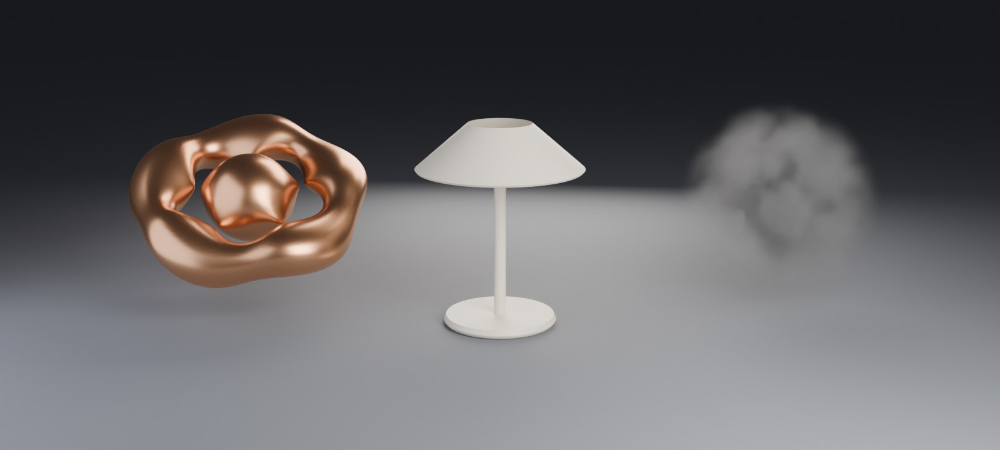

# CodeNodes

**Code that becomes real Blender geometry.** You (or an AI assistant) write a little code: a GLSL
distance function, a density, a particle solver, or a few lines of a small shape language.
CodeNodes turns it into a mesh, a volume or a point cloud that Blender treats like anything else:
light it, render it in EEVEE or Cycles, add modifiers, export it.

It also lets an assistant build, read and edit ordinary **Geometry Nodes** setups, and publish
scenes as interactive web pages.



*Left to right: a GLSL distance function meshed on the GPU, a lamp written in the shape language,
and smoke from a density function. All three come from the snippets below.*

> **Status: early (v0.1).** Everything listed as *works* is covered by tests on Blender 5.0.1 and
> 5.1.2, on Windows 11 with an NVIDIA GPU. Other platforms haven't been tried yet.
>
> **Licence: to be decided.** Until a licence file is added, please ask before reusing the code.

## What's in it

| Feature | What it does | Status |
|---|---|---|
| **Code → Mesh** | GLSL signed distance function → watertight quad mesh, sampled on the GPU | works |
| **Code → Shape** | a small shape language → exact, constructed meshes with sharp edges and real UVs | works |
| **Code → Volume** | GLSL density → OpenVDB volume that renders natively | works (script/API only, no panel yet) |
| **Code → Particles** | your own GPU particle solver → a point cloud with velocity, age and life | works |
| **Node editor** | code nodes with typed sockets that compile into one GPU program | works |
| **Bake to Disk** | animations written to files that play back with stock nodes; renders with no GPU and no add-on | works |
| **Bake to Nodes** | the GLSL itself becomes a Geometry Nodes network | experimental (needs the ExpressNode add-on, not public yet) |
| **Assistant link (MCP)** | lets an assistant such as Claude build, render and look at its work; fixed tool list, no arbitrary code | works |
| **Geometry Nodes agent** | build, explain and edit any node tree as data; a library of tested capabilities (terrain, scatter, walls, rooms, roofs, stairs, water, paths) | works |
| **Web pages** | a scene as one self-contained page with sliders; Code Shapes rebuild live in the browser | works |
| **Buildings from a spec** | a written spec → floor plan → building → equipment → checks (factories, warehouses, simple houses) | experimental |
| **`geonodes/` library** | node-group assets and example scenes that open in plain Blender, no add-on needed | experimental |

## Requirements

- **Blender 5.0 or newer.**
- **A GPU and a Blender window** for the live GPU features (Code → Mesh, Volume, Particles). Background
  Blender (`-b`) has no GPU, so bake first for headless renders. Shapes, Geometry Nodes and the web
  export all work headless.
- **For the assistant link:** Python 3.10+ for the MCP server (MCP SDK 1.x or 2.x), and an MCP client
  such as Claude Code.

## Install

1. **Get the extension zip.** Download it from the Releases page once one is published, or build it
   from a clone of this repo:

   ```
   mkdir dist
   blender --command extension build --source-dir codenodes --output-dir dist
   ```

   That writes `dist/codenodes-0.1.0.zip` (Blender needs the `dist` folder to exist first).
2. **Install it.** Edit › Preferences › Get Extensions › the ⌄ menu at the top right ›
   **Install from Disk…** › pick the zip. It's enabled straight away.
3. **Optional: connect an assistant.**
   1. In Blender: 3D Viewport › Sidebar (N) › **CodeNodes** › **Assistant** › **Start**. Blender writes
      a token to its config folder; the link only listens on this computer (127.0.0.1).
   2. Install the MCP server once, in its own Python environment:

      ```
      python -m venv codenodes-mcp
      codenodes-mcp/Scripts/pip install -e path/to/CodeNodes/mcp      # on macOS/Linux: codenodes-mcp/bin/pip
      ```
   3. Tell your MCP client about it. For Claude Code:

      ```
      claude mcp add codenodes -- path/to/codenodes-mcp/Scripts/codenodes-mcp
      ```

      With [`uv`](https://docs.astral.sh/uv/) installed, `claude mcp add codenodes -- uvx --from path/to/CodeNodes/mcp codenodes-mcp` works too.
   4. Try it: ask the assistant to *"use CodeNodes to make a wall with two doorways along an L-shaped
      curve, then render it"*. It should build it, render it and describe what it sees.

   More in [mcp/README.md](mcp/README.md). The server only runs while Blender is open and you've pressed
   Start. To update CodeNodes, install a newer zip over the old one.

## Quick start

| To try | Do this |
|---|---|
| Code → Mesh | Add › Mesh › **Code Mesh**, then Sidebar (N) › **CodeNodes**. Edit the code in its Text block; the mesh rebuilds. |
| Code → Shape | Add › Mesh › **Code Shape**. Sliders appear for every `param` line. |
| Code → Particles | Add › Mesh › **Code Particles**, then play the timeline. |
| Code → Volume | From the Python console: `from bl_ext.user_default.codenodes import api, volume` then `api.code_to_volume(volume.TEMPLATE, name="Smoke")`. |
| Node editor | Open a Node Editor and switch its type to **CodeNodes** (or Sidebar › CodeNodes › **New Node Graph**). |
| Geometry Nodes capabilities | From a clone of this repo: `blender -b --factory-startup --python examples/village_demo.py -- out` builds and renders the village above into `out/`. |
| Web page with sliders | `blender -b --factory-startup --python examples/web_simple.py -- courtyard.html`, then open the page in a browser. |
| The library without the add-on | Open anything in [`geonodes/`](geonodes/) in plain Blender (see its README). |

The examples run straight from a clone (they load CodeNodes from the repo, no install needed) and
are listed in [examples/README.md](examples/README.md). Everything below goes into
each feature in more detail.

## Code → Mesh

Write a signed distance function (negative inside, positive outside). CodeNodes samples it on the
GPU and builds a real, watertight quad mesh.

```glsl
// @param radius 1.0 0.2 2.0
// @param thickness 0.3 0.05 0.8
float sdf(vec3 p) {
  return smin(sdTorus(p, radius, thickness), sdSphere(p, 0.6), 0.4);
}
```

Each `// @param name default min max` line becomes a slider. Your slider values are kept when the
code changes, so an assistant can rewrite the code without resetting what you tuned. **Live**
rebuilds as you edit; **Animate** rebuilds every frame, with the time in `uTime`.

## Code → Shape

Maths turned into a model that is *constructed* rather than sampled. Declare sliders, describe a 2D
profile, then spin or push it:

```
param height  0.34  0.10 0.80
param radius  0.14  0.03 0.40

part shade
  profile
    move  radius * 0.38, height
    curve x = radius * (0.38 + 0.62 * t)  y = height - height * 0.22 * t  steps 20
  revolve segments 72
```

Every number can be maths, so the whole object is one formula. Because the mesh is built rather
than marched, **edges land exactly where the maths puts them, corners stay sharp, the quads follow
the form, and the UVs mean something**: good for lamps, bottles, columns, walls and anything turned
or extruded. Add › Mesh › **Code Shape**, or `api.code_to_shape(source)`.

| command | what it does |
|---|---|
| `param name default min max` | a slider |
| `part name [add\|subtract\|intersect]` | a piece, and how it combines with the others |
| `profile` › `move` `line` `arc` `curve` `close` `shell` | a 2D outline; `shell` gives an open one thickness |
| `path` › `move` `line` `curve` `helix` | a 3D route to carry a profile along |
| `revolve` `extrude` `sweep` `loft` | turn the profile(s) into a solid |
| `translate` `rotate` `scale` `array` | place and repeat it |
| `bevel width segments n` | round the sharp edges |
| `finish` | a last block: `bevel`, `smooth`, applied to the whole thing |

Functions: `sin cos tan asin acos atan atan2 sqrt abs sign floor ceil round exp log pow min max mod
hypot clamp mix smoothstep radians degrees`, plus `pi`, `tau`, `e`, and `t` inside a `curve`.

`subtract` lets one part cut another (a hole drilled through a block), `sweep` along a `helix`
makes springs and screw threads, and `loft` blends one profile into another. **Profile as Curve**
draws the outlines as a real curve object, which is far easier to judge by eye than a column of
numbers.

It is a language CodeNodes parses itself, not Python, so a description from anywhere is safe to
build.

## Code → Volume

Write a density instead of a distance and get smoke, cloud or nebula geometry that EEVEE and Cycles
render natively:

```glsl
// @param scale 1.6 0.2 6.0
float density(vec3 p) {
  return clamp(1.0 - length(p) / 1.6 + 0.5 * (fbm3(p * scale) - 0.55), 0.0, 1.0);
}
```

```python
api.code_to_volume(source, name="Smoke", resolution=96)                    # one frame
api.code_to_volume(source, name="Smoke", frame_start=1, frame_end=48)      # a .vdb sequence
```

Volumes are written as OpenVDB files, so a sequence plays back natively with no add-on and no GPU.

## Code → Particles

Write the solver yourself. `spawn` places a particle, `update` moves it, and CodeNodes keeps the
state on the GPU and steps it as the frame changes:

```glsl
// @param speed 1.0 0.0 4.0
void spawn(inout Particle p) {
  p.position = randBall(p.seed) * 1.8;
  p.life = 4.0 + rand1(p.seed * 3.3) * 3.0;      // then it respawns
}
void update(inout Particle p, float dt) {
  p.velocity = vec3(-p.position.y, p.position.x, 0.2) * speed;  // your own field: a swirl
  p.position += p.velocity * dt;
}
```

`Particle` carries `position`, `velocity`, `age`, `life` and a per-particle `seed`. The points come
out as a real point cloud with `velocity`, `speed`, `age` and `life` attributes, so Geometry Nodes
can instance anything onto them and Cycles uses `velocity` for motion blur. (The Add › Code
Particles template shows a curl-noise field written the same way.) Shade with **`speed`**, not
`velocity`: Blender reserves that name for motion blur and a shader can't read it back.
Add › Mesh › **Code Particles**, or `api.code_to_particles(source, name="Swirl", count=20000)`.

300,000 particles simulate in about 12 ms per frame on an RTX A4500.

## From a script

```python
from bl_ext.user_default.codenodes import api      # the extension's module path
api.code_to_mesh(source, name="Ring", resolution=128)
# {"ok": True, "faces": 18432, ...}, or {"ok": False, "error": "line 3: undefined variable 'lenght'"}
api.set_params("Ring", radius=1.4)
print(api.reference())                             # the helper functions available in GLSL
```

Errors never raise. They come back with the line number in *your* code, so a caller can fix the code
and try again.

## Node editor

Open a Node Editor and switch its type to **CodeNodes** (or View3D › Sidebar › CodeNodes ›
**New Node Graph** for a starter graph).

| node | does |
|---|---|
| **SDF Code** | code in a Text block; each `@param` line becomes an input socket |
| **Combine** | Union, Subtract, Intersect, Smooth Union, Smooth Subtract (blend width K) |
| **Transform** | move, rotate, scale a shape |
| **Offset** | grow or shrink a shape |
| **Mesh Output** | Code → Mesh: target object, resolution, bounds, Live, Animate |
| **Particles** | a solver in code; its `@param` lines become input sockets |
| **Points Output** | simulates and shows the points on an object, with the same Live / Animate / Bake |
| **Shape** | a parametric description; its `param` lines become input sockets |

The whole graph compiles into one GPU program. Each code node's functions and parameters get a
per-node prefix, so two nodes can both define `bump()`. A compile error names the node and the line
inside it, and that node shows the error too. Reroutes and muted nodes pass shapes through, and
graphs can have up to 256 sliders.

## Driving it from an assistant

`codenodes.agent` is the surface an assistant works through. Every call returns a plain dict and
never raises for a fixable mistake, so a model can read the error, fix its code and try again:

```python
from bl_ext.user_default.codenodes import agent
agent.help()                                   # the kinds, the GLSL helpers, a template for each
agent.make("mesh", code, name="Ring")          # or "particles" / "volume" / "shape"
agent.set_params("Ring", radius=1.4)
agent.look_at("Ring"); agent.light("studio")   # frame it, light it
agent.render()                                 # -> {"path": "...png"} to open and look at
agent.scene()                                  # what exists, with each object's kind and sliders
agent.bake("Ring", 1, 48)
```

`look_at` and `light` exist because a render with no camera aim or lighting comes out black, which
wastes a whole round trip.

**Over MCP.** `mcp/` is an MCP server that exposes those functions to an assistant, so it can build
something, render it and look at what it made. It is localhost-only, needs a token, and **has no way
to run arbitrary code in Blender**: the add-on answers only the names in its own tool table. See
[mcp/README.md](mcp/README.md).

## Geometry Nodes, built and edited by an assistant


*Terrain with a canyon, a trail that turns into a bridge where it crosses, a walled courtyard that
follows the ground, a forest that keeps clear of both, lamps along the trail, and the trees and
lamps modelled in the shape language. Every step was one tool call:
[`examples/level_demo.py`](examples/level_demo.py). Built in under a second, rendered in 11.*

`codenodes.gn` lets an assistant work with ordinary Geometry Nodes: build a setup, understand one
that already exists, and change part of it without disturbing the rest.

**A library of tested capabilities** to compose rather than write from nothing. Each is an ordinary
node group with its controls as modifier sliders, seeded so the same seed gives the same result:

| capability | what it does |
|---|---|
| `terrain` | rolling ground from noise; an optional winding canyon; rock on anything steeper than Cliff Angle |
| `scatter` | trees, rocks, props over a surface, kept off steep slopes and clear of paths and buildings, picked from a collection |
| `wall` | a solid wall along a curve with doorways and posts; follows uneven ground and stays vertical |
| `path_bridge` | a walkway that hugs the ground and becomes a bridge (railings, posts, pillars) wherever the ground falls away |
| `along_curve` | things beside a curve at a spacing (lamps, benches): one side, both, or alternating |
| `wall_network` | walls along every spline of a curve, joined into one solid at corners, T's and crossings; doorways that keep off the junctions |
| `rooms` | a floor plan of closed outlines → floors, walls joined where rooms touch, one doorway between each pair of rooms, windows along outside walls, an entrance |
| `roof` | flat, gable or hip (equal pitch all round) with an overhang, stacked after `rooms` on the same object |
| `stairs` | stairs (even steps no taller than Step Height) or a ramp along a curve, between its two end heights, solid to the ground, optional side walls |
| `water` | a water surface along a curve, and terrain's **Carve** inputs, which cut a riverbed (or flatten a road) along a curve and ease the banks back |


*A house from a three-room floor plan with a hip roof, a yard of walls meeting at a T and two corners
on uneven ground, stairs, and a river carved into the terrain:
[`examples/village_demo.py`](examples/village_demo.py).*

```python
agent.curve("Trail", [[-9, -44, 1], [0, -8, 1.6], [12, 44, 1]])
agent.nodes_use("path_bridge", "Trail", {"Ground": "Ground", "Gap Depth": 1.2})
agent.nodes_set_inputs("Trail", {"Width": 3.0})          # later: "make it wider"

agent.curve("House", splines=[[[0, 0], [7, 0], [7, 5], [0, 5]],     # rooms share corners
                              [[7, 0], [11, 0], [11, 5], [7, 5]]], cyclic=True, smooth=False)
agent.nodes_use("rooms", "House", {"Entrance": 0})
agent.nodes_use("roof", "House", {"Style": 2})             # the next modifier: sits on the walls
```

**Any node setup, as data, both ways.** The catalog is read out of Blender itself (about 320 node
types) and says for every socket **whether it can take a field or only a single value** (the most
common way a setup goes wrong) and, for Blender 5's menu sockets, what the choices are.

```python
agent.nodes_find("distribute points")     # what exists, and exactly what it takes
agent.nodes_write(description)            # build a tree from plain data; sockets named plainly
agent.nodes_explain("MyGroup")            # an existing tree in words, in flow order
agent.nodes_edit("MyGroup", [{"op": "insert", "node": {...}, "between": {...}}])
agent.nodes_check("MyGroup")              # what came out: mesh, curves, points, instances, size
```

- **The round trip is lossless**, including the parts that usually break: nodes whose sockets you
  add yourself (Capture Attribute, Repeat and Simulation zones, Menu and Index Switch), whose socket
  identifiers are *not* stable across a rebuild; groups inside groups; panels.
- **Edits are all or nothing** (tried on a copy first) and keep the group's socket identifiers, so
  values tuned on the modifier survive.
- **Mistakes are explained in terms of the node**: *"'Value' is a field (it varies per element) but
  'Vertices X' on 'grid' takes a single value"*, or *"'grid' has no input 'Sise'. It has: Size,
  Vertices X…"*.

The same tools are MCP tools, alongside `material`, `collect`, `curve`, `light("outdoor")`,
`look_at` and `render`, so an assistant can build a scene, look at it and fix what it sees.

## Buildings from a spec (experimental)

"Make me a 60 x 40 m factory floor with docks, racking, machining, two robot cells, QA and offices"
becomes a spec (spaces with areas, closeness ratings, material flow, equipment), and six tools do the
rest:

```python
agent.plan_site(spec, name="Plant")      # or example="factory"; a plan, a text grid, a picture
agent.edit_plan("Plant", [{"op": "swap", "a": "QA", "b": "Offices"}])
agent.build_plan("Plant")                # walls with every door and dock cut, roof, columns, lights
agent.place_equipment("Plant")           # conveyors, fenced robot cells, rack rows, machine rows
agent.verify("Plant")                    # collisions, aisles, egress walk, reach, floating parts,
                                         # openings, mesh intersections; renders three views
agent.assets("robot_arm")                # a generator's sliders, clearances and joints
```

The same six are MCP tools. Everything is built from the Geometry Nodes library and 17 parametric
generators. It's a first pass: layouts are sensible and every check passes, but the equipment is
simple and blocky and house plans come out boxy. How it works and why:
[docs/MODELING_RESEARCH.md](docs/MODELING_RESEARCH.md).


## To the web, with sliders

`agent.web_page` writes a scene as one self-contained page (three.js, orbit controls) with a slider
for any modifier input, and it runs headless:

```python
agent.web_page("level.html", title="Canyon Crossing", sliders=[
    {"object": "Courtyard", "input": "Doorways", "values": [0, 1, 2, 3, 4]},
    {"object": "Trail", "input": "Gap Depth", "values": [1.2, 4, 20], "unit": "m"}])
```

Geometry Nodes can't run in a browser, so every slider position is built in Blender first and
exported as glTF. Each slider is tried at every value to find what it *really* changes, and sliders
that change the same objects are baked as combinations, so the page never shows a mix that couldn't
exist. [`examples/web_demo.py`](examples/web_demo.py) turns the level above into a 5.8 MB page with
four sliders, and [`examples/web_simple.py`](examples/web_simple.py) makes a small one.

**Code Shapes go live instead.** A shape is written in CodeNodes' own small language, so the browser
can build it itself: `agent.web_shape` (MCP `web_shape`) writes a page carrying the shape's text and
a JavaScript copy of the builder, and every slider rebuilds the mesh as it moves, at any value.
Nothing is baked, and the page is about 60 KB. The lamp rebuilds in 5–10 ms.

```python
agent.make("shape", TEMPLATE, name="Lamp")
agent.web_shape("lamp.html", object="Lamp", colors={"shade": [0.9, 0.55, 0.2]})
```


The JavaScript (`codenodes/shapes/shapes.js`) is a line-for-line port, and `tests/test_shape_js.py`
holds it to the Python: every command, at several slider values, gives the same vertices to float32
precision and the same faces in the same order. Parts that cut other parts (`subtract`, `intersect`)
need Blender's boolean solver, so those shapes are refused (bake them with `web_page`); bevels are
left off.

The `web/` folder has a few standalone graphics showcases (a raymarched citadel, a procedural planet,
a million-particle simulation, a raster flythrough, a mesh editor) made alongside CodeNodes; open
them in a browser with WebGL2. Two of them load three.js from a CDN, so they need an internet
connection.

## Animation, and making it render

There are three phases.

1. **Live.** Turn on **Animate** and the mesh rebuilds on every frame change, using `uTime`. This is
   for working, not for rendering: running GPU code from a frame handler during an F12 render crashes
   Blender, and background Blender has no GPU at all.
2. **Baked.** Press **Bake to Disk**, pick a frame range, and CodeNodes writes one file per frame next
   to your .blend and builds a small node group (Scene Time → Format String → Import PLY) that plays
   it back. From then on it's ordinary Geometry Nodes geometry: it renders in F12, on a machine with no
   GPU and without this add-on. **Remove Cache** goes back to live.
3. **Bake to Nodes (experimental).** The code itself becomes a Geometry Nodes network: no files, no
   GPU, evaluated natively every frame, sliders on the modifier. CodeNodes translates the GLSL into
   the language of ExpressNode (a separate add-on, not public yet), which builds the node group;
   a Volume Cube (density = −sdf) and Volume to Mesh make the surface. Tested against the GPU mesh from
   the same code: the same vertices, after a slider change and on an animated frame. About 8 ms per
   rebuild at resolution 96.

   What translates: local variables, maths, `?:`, your own helper functions and CodeNodes' distance
   helpers (`sdSphere`, `sdBox`, `smin`, `rotateZ`…), `uTime`/`uFrame`. Loops, `if` statements and
   `noise3`/`fbm3` don't yet: the button says which line and suggests Bake to Disk.

```python
api.bake("Blob", 1, 48)     # to disk
api.bake_to_nodes("Ring")   # to nodes: {"ok": True, "sliders": [...]} or {"ok": False, "error": "line 9: a loop...", "fallback": "bake"}
```

## What keeps it from crashing

- A shader that doesn't compile is a message, not a crash. The driver's log is captured and mapped
  back to your line numbers.
- The GPU only samples the grid; the meshing is pure numpy. One slice is timed first, and code that
  would take too long is refused before it can stall the GPU. Work runs in short slabs.
- Resolution (8–512), memory (1 GiB) and texture size are checked before anything runs.
- A new mesh is built on the side and swapped in only when everything succeeded, so a failed build
  leaves the object as it was. Materials and modifiers carry over, and old mesh data is freed.
- Animate is skipped while a render job runs.

## Known limitations

- **Tested on Windows only** (Windows 11, NVIDIA RTX A4500, OpenGL). macOS, Linux and other GPUs
  haven't been tried.
- GPU code (Code → Mesh, Volume, Particles) needs Blender with a window. Bake first for headless renders.
- Code → Volume has no node or panel yet; it's used from scripts and the assistant.
- Surface nets rounds off sharp edges and corners slightly. For crisp edges, use Code → Shape.
- Baked file paths are absolute, so moving a .blend with a bake breaks its playback. A relative-path
  mode is planned.
- Roofs cover a plan's bounding box; L- and T-shaped plans don't get proper roofs yet.
- Buildings from a spec and the `geonodes/` library are experimental (see above).
- Bake to Nodes needs the ExpressNode add-on, which isn't public yet.

## Tests

```bash
python tests/test_mesher.py                                    # mesher, no Blender (17 checks)
python tests/test_graph.py                                     # graph compiler, no Blender (16)
python tests/test_shapes.py                                    # maths, the kernel, the language (98)
python tests/test_shape_js.py                                  # the browser's copy builds exactly what Python does (23)
python tests/test_rpc.py                                       # the MCP wire protocol, and the MCP server matches the add-on (31)
python tests/test_factory.py                                   # spec, planner, generators, layout, verifier, edits (129)
blender --factory-startup --python tests/test_blender.py       # needs a window: the GPU isn't available with -b (29)
blender --factory-startup --python tests/test_nodes.py         # node editor, incl. save/reload (30)
blender --factory-startup --python tests/test_bake.py          # baking, and playback through stock nodes (18)
blender --factory-startup --python tests/test_bake_nodes.py    # code to nodes, against the GPU mesh (11; needs ExpressNode)
blender -b --factory-startup --python tests/test_farm.py       # the bake renders with no GPU and no add-on (10)
blender --factory-startup --python tests/test_volume.py        # density code -> OpenVDB -> Volume object (16)
blender --factory-startup --python tests/test_particles.py     # GPU particle solver, incl. baking (22)
blender --factory-startup --python tests/test_agent.py         # the assistant-facing surface (31)
blender --factory-startup --python tests/test_shape_blender.py # shapes as Blender objects (36)
blender --factory-startup --python tests/test_server.py        # a real socket client against Blender (26)
blender -b --factory-startup --python tests/test_gn.py         # Geometry Nodes as data, both ways (60)
blender -b --factory-startup --python tests/test_gn_library.py # every capability; editing real trees (72)
blender -b --factory-startup --python tests/test_web.py        # a scene as a web page with sliders; a live shape page (16)
blender -b --factory-startup --python tests/test_factory_blender.py   # building, equipment, scene checks, house (30)
blender -b --factory-startup --python tests/test_geonodes_library.py  # geonodes/ in plain Blender, no add-on (15)
node tests/web_shape_check.mjs <page folder>                   # a live shape page in headless Edge (7; needs puppeteer-core)
powershell -File tests/install_check.ps1 -Python <venv python> -Work <scratch folder> -Blenders <blender.exe>,...
    # the zip installed as a user installs it, then the whole loop through the real MCP process (29 per version)
```

Run `test_bake.py` before `test_farm.py`: the first saves the .blend the second opens. The
windowed tests quit by themselves when they finish. Test output goes to your temp folder, not the
repo.

## Project layout

| Folder | What's there |
|---|---|
| `codenodes/` | the Blender extension (the part you install) |
| `mcp/` | the MCP server that connects an assistant to the extension |
| `geonodes/` | node-group assets and example scenes that need no add-on |
| `examples/` | scripts that build the demo scenes and pages |
| `web/` | standalone browser showcases |
| `docs/` | roadmap, research notes and images; start at [docs/README.md](docs/README.md) |
| `tests/` | the test suites above |

## Licence

To be decided. Until a licence file is added, the code is not licensed for reuse; please ask first.
