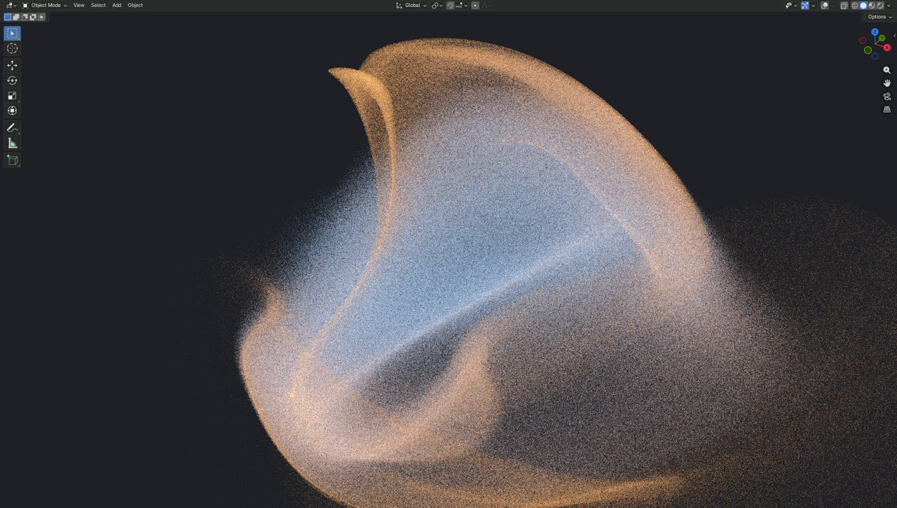
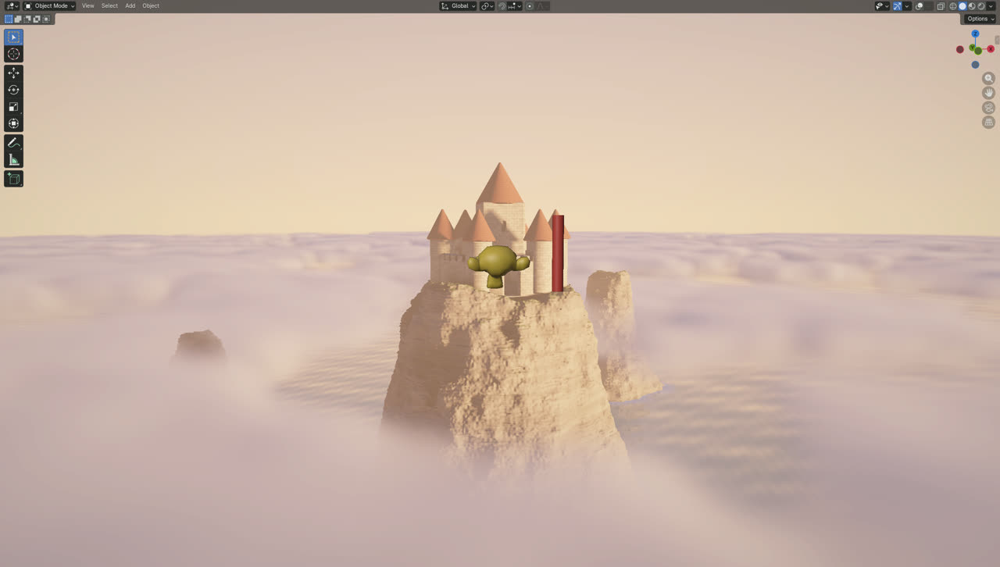
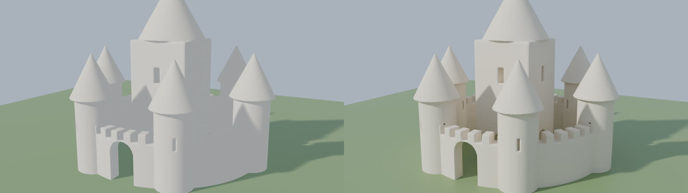
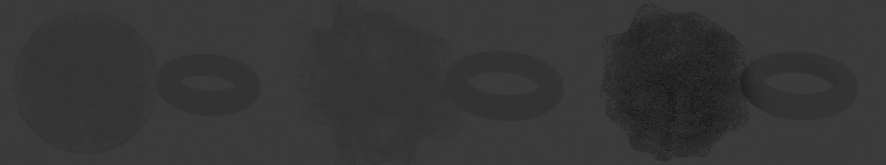
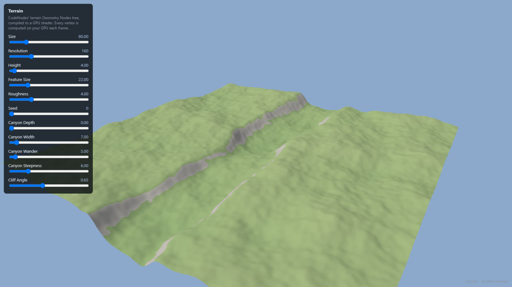

# Feasibility: GPU code in Blender, and node trees on the web

Measured on 2026-09-28 on the development PC (NVIDIA RTX A4500, Windows, Blender 5.1.2, OpenGL
backend, 2560 × 1452 viewport, 120 Hz display). Everything below was run and looked at, not
estimated. The prototypes live outside the add-on; nothing in CodeNodes was changed.

## The short answer

| Question | Verdict |
|---|---|
| 1. Live GPU results in the viewport, fast, without copying to Blender geometry | **Works** |
| 2. Showcase-quality scenes (Aerie) inside Blender | **Works, with limits** |
| 3. Geometry Nodes data into GPU code and back out | **Works, with limits** |
| 4. Renders use the results, and GPU code never runs during a render | **Works** |
| 5. A Geometry Nodes tree running live on the web | **Works for the tested tree; coverage is the job** |
| 6. Blender objects to the web (existing routes) | **Works** |

**How the showcases were made.** Aerie, Tellus and Myriad were hand-written WebGL 2 shaders.
Sanctum and Rampart were hand-written three.js. None of them was converted from a Geometry Nodes
tree. Aerie's castle was CodeNodes-style GPU code shared with Blender ("Copy for Blender" makes a
Code Mesh), and the Canyon Crossing and Courtyard Wall pages used baked GLB variants. Section 5 is
the first time a real Geometry Nodes tree has been turned into GPU code, and it matched Blender
exactly.

---

## 1. Live GPU results in the viewport — works

Blender 5.1's Python `gpu` module has real compute shaders (`gpu.compute.dispatch`, with image load
and store on RGBA32F textures). So particles can be stepped on the GPU and drawn straight from GPU
memory by a viewport draw handler, with no copy into Blender data.

| Particles | Drawn straight from the GPU | Copied into a point cloud every frame (the current approach) |
|---|---|---|
| 100,000 | 121 fps | 67 fps (copy 4 ms) |
| 1,000,000 | 121 fps | 24 fps (copy 29 ms) |
| 4,194,304 | 120 fps | 5 fps (copy 155 ms) |

- **The display's refresh rate is the ceiling.** 120 fps at 4.19 million particles is the 120 Hz
  cap, so the real headroom is larger.
- **Copying is the bottleneck.** Copying into Blender geometry every frame is what's slow, about 30× slower at 1M.
- **Baking to real geometry on demand is cheap:** 15 ms for 100k, 49 ms for 1M, 224 ms for 4.19M.
  That produces a mesh with positions plus an `age` attribute.

**Limits:**
- Drawn particles are a viewport overlay. They aren't selectable, other objects and Geometry Nodes
  can't see them, and F12 renders don't include them until they're baked.
- Tested only on the OpenGL backend. Blender's Vulkan backend and other GPUs are untested.

## 2. Showcase quality inside Blender — works, with limits

Aerie's own GLSL (helpers, castle code, rock, clouds, ocean, sky) was lifted straight out of
`web/aerie.html`. Only the camera and a depth output were changed, and it was drawn in the 3D
viewport. It renders at a fraction of the viewport size into colour and depth targets, then a
composite pass depth-tests it against Blender's own objects, as the web page does while moving.

| Internal resolution | fps |
|---|---|
| 35% (896 × 508) | 125 |
| 50% (1280 × 726) | 124 |
| 75% (1920 × 1089) | 94 |
| 100% (2560 × 1452) | 61 |

The monkey and the red pillar are ordinary Blender objects. They sit correctly in front of and
behind the castle.

**The castle as a real mesh.** Code Mesh turns the same castle code into 308,702 faces in 1.2 s
(185 ms of it on the GPU). At 1280 × 720 it renders in 0.84 s in EEVEE and 7.5 s in Cycles at 64
samples. Gate, battlements, arrow slits and windows all survive.

**Limits:**
- **Lighting:** the viewport scene's sun, fog and clouds don't light Blender's objects, which are shaded by the viewport as usual.
- **Clouds:** they don't hide objects behind them. The depth written is the solid surface's.
- **Renders:** F12 renders don't include the overlay. For a final render, the geometry has to be real:
  - Code Mesh for the castle and rock
  - Code Volume for the clouds
  - a world shader for the sky

  Only the castle was tried.

## 3. Geometry Nodes into GPU code and back — works, with limits

The setup:
1. A Geometry Nodes tree scatters points on a wavy surface and stores a per-point `heat` attribute.
2. Python reads the evaluated points and uploads them to the GPU.
3. A compute shader emits particles from them, with heat setting their speed.
4. The result is written back to a point-cloud object.
5. A second Geometry Nodes tree (Object Info → Instance on Points) instances cubes on it.

The particles really moved: 0.75 m on average over 30 steps.

| Points | Read from GN | Upload | Read back | Write mesh | GN instancing | **Round trip per frame** |
|---|---|---|---|---|---|---|
| 10,430 | 0.1 ms | 0.3 ms | 0.1 ms | 0.2 ms | 3.0 ms | **3.7 ms** |
| 104,161 | 0.1 ms | 1.5 ms | 2.2 ms | 1.1 ms | 2.6 ms | **7.5 ms** |
| 1,042,195 | 2.9 ms | 10.7 ms | 27.8 ms | 12.2 ms | 15.3 ms | **69 ms (~14 fps)** |

**Limits:**
- **It crosses between objects, not inside one tree.** Geometry Nodes writes attributes on one object, the GPU graph reads them,
  and the result is another object that Geometry Nodes reads with Object Info.
- **Live up to a few hundred thousand points.** At 1M, the round trip drops to about 14 fps.
- **The scatter's own evaluation time wasn't isolated** in this test.

## 4. Renders — works

200,000 GPU particles and an animated Code Mesh (live and animate on, the risky case) were baked
over 24 frames, then rendered at 640 × 360. A slider was changed right before rendering, to tempt
a rebuild.

| | Time |
|---|---|
| Bake 200k particles, 24 frames | 1.8 s (164.8 MB cache) |
| Bake animated Code Mesh, 24 frames | 0.9 s (3.3 MB) |
| EEVEE F12 / 24-frame animation | 0.62 s / 6.9 s |
| Cycles F12 / 24-frame animation (16 samples) | 3.2 s / 64 s |

- **No GPU code ran during a render:** 0 of 99 GPU calls happened mid-render. The pending slider
  change was applied between renders, not during one.
- **The frames animate.** The particle sphere swirls out between frame 1 and frame 24.
- **Cache size is the limit.** 200k particles take about 6.9 MB per frame, so millions of baked particles will need
  a leaner cache format (half floats, fewer attributes).

## 5. A Geometry Nodes tree live on the web — works for the tested tree

CodeNodes' real **terrain** capability tree was read with `gn/serialize`: 63 nodes, with 4D fBm noise, a
winding canyon term, a carve branch and slope-based materials. It was then run two ways in the
browser.

1. **A JavaScript interpreter** of the tree, including an exact port of Blender's Perlin noise
   (the Jenkins hash, gradients and fBm). It matched Blender on every vertex to within
   **0.000016 m** (float precision) at three slider settings. But it takes 100–250 ms per rebuild
   at 8–25k vertices, which is correct but not smooth.
2. **A compiler to a GPU shader.** The whole tree becomes a 101-line GLSL vertex shader, and every
   group input becomes a uniform, so sliders never recompile anything. The terrain is computed on
   the GPU every frame.
   - **Accuracy:** it matched Blender on every vertex to within **0.000022 m** at the same three settings.
   - **Speed:** 120 fps (the display cap) while sliders move, at 25,600 and at **360,000 vertices**.
   - **Readback:** evaluating and reading back 25,600 vertices takes about 5 ms.

Two things made it exact:
- **Blender's noise has to be ported exactly,** not approximated.
- **GLSL's `mod()` isn't C's `fmod`.** It turns negative numbers positive, which moved every
  negative coordinate onto a different noise lattice. The first GPU version was metres off until
  that was fixed.

**How much of CodeNodes' library could run live.** The census covers all 10 capabilities: 729 nodes of 70 types.

| Kind of node | Nodes | Share | Route to the web |
|---|---|---|---|
| Per-point maths and fields: Math, Vector Math, Combine/Separate, Compare, Boolean Math, Switch, Set Position, Transform, Position, Index, Normal, Random Value, Map Range, Noise, rotations, Set Material/Smooth | 536 | 74% | GPU shader (proven on terrain) |
| Data-parallel but more work: Instance on Points, Realize Instances, primitives (grid, cube, cylinder, circle...), Capture Attribute, Join, Delete, Duplicate, Sample Curve/Index/Nearest, Proximity, Raycast, Resample and Subdivide Curve, Distribute Points | 156 | 21% | WebGPU compute, or JavaScript |
| Topology-heavy: Curve to Mesh (13), Mesh Boolean (5), Fillet Curve, Fill Curve, Merge by Distance, Flip Faces, Mesh to Curve | 27 | 4% | JavaScript or WebAssembly (e.g. the Manifold boolean library), or baked |
| Needs Blender data: Object Info, Collection Info | 10 | 1% | export that data with the page |

- **A tree is only live when every node on its active path is supported.** Today that's the terrain, with the
  carve branch skipped when no curve is given; the compiler folds that branch away.
- **The other capabilities** (walls, rooms, bridges, scatter...) depend on Curve to Mesh, booleans,
  instancing and raycasts.
- **Work needed, in order:**
  1. The rest of the per-point nodes: all maths operations, all noise types, Voronoi. That's small,
     one family at a time, each tested against Blender like the terrain.
  2. Instancing, primitives and sampling on WebGPU compute. That's medium.
  3. Curve to Mesh and booleans. That's large, and the right home is probably CPU or WebAssembly.
- **Anything unsupported can fall back to baked variants**, as a web exporter's slider configurator can do.

## 6. Blender objects to the web — works

- **A companion web exporter's (not yet public) showcase test passes 17/17:**
  - GLB viewer
  - VGEO streaming with a GLB fallback
  - an instanced scene (2 assets, 63 placements)
  - Configurator with 8 baked variants
  - video and sprite sheets
- **A CodeNodes object exports to GLB.** The Code Mesh castle at 119,448 faces exports in 0.6 s. The file is 5.6 MB, or 366 KB
  with Draco compression.

---

## Recommended architecture

1. **The heart is a graph of GPU code nodes.** GLSL in Blender, run with compute and draw
   handlers. The same code translates to WebGL 2 or WebGPU for the browser.
2. **Heavy results are drawn live, not copied.** Particles and raymarched scenes draw straight
   from the GPU in the viewport. Real geometry is produced only when asked: a bake, a render, or
   something downstream that needs it.
3. **Geometry Nodes ↔ GPU crosses through attributes on objects.** Plan for up to a few hundred
   thousand points live. Above that, bake.
4. **Renders read bakes.** The render guard works and should stay strict.
5. **Node trees go to the web through a tiered compiler:**
   - per-point field nodes become GPU shaders (proven)
   - topology nodes run on the CPU (JavaScript or WebAssembly)
   - anything unsupported falls back to baked variants

   The add-on should show, per tree, which parts will be live and which baked, before export.
6. **Objects go to the web through a companion exporter (not yet public),** which already works (GLB, VGEO streaming, variants).

## What not to promise yet

- That viewport GPU scenes appear in F12 renders as they are. Renders need real geometry, volumes or a
  world shader.
- That Blender objects are lit by a raymarched scene, or hidden by its clouds.
- That every Geometry Nodes tree runs live on the web. Only the supported subset does, and the rest is baked.
- Millions of particles as editable Geometry Nodes geometry every frame. About 14 fps at 1M is the
  measured limit.
- Exact matches for noise types other than Perlin fBm until each is ported and tested.
- Behaviour on the Vulkan backend, AMD or Intel GPUs, or macOS. Only NVIDIA on OpenGL was tested.
