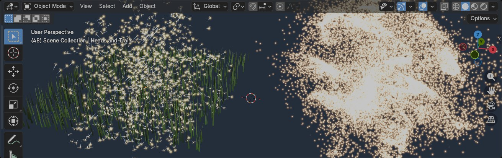
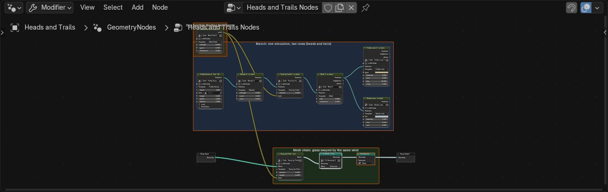
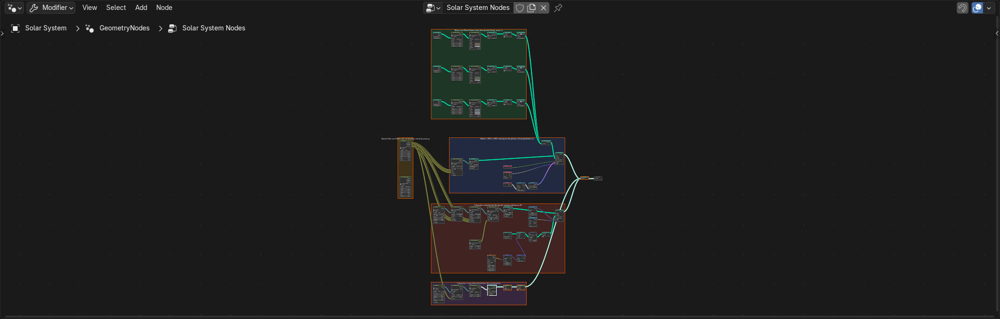
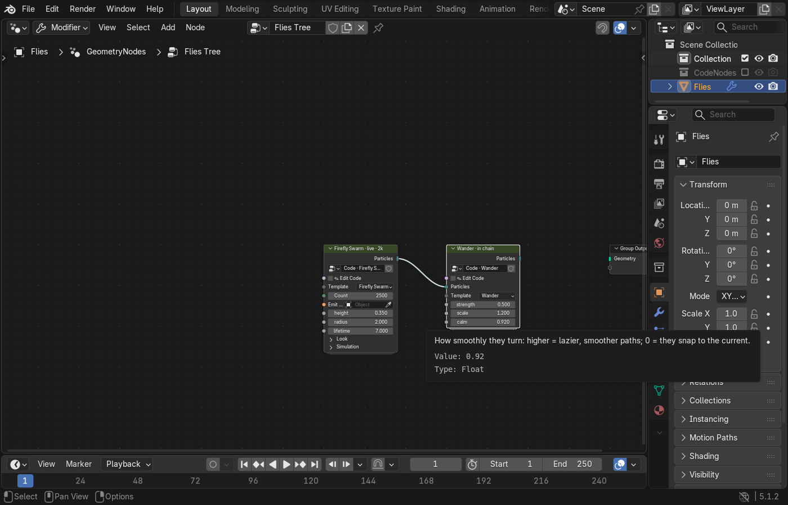
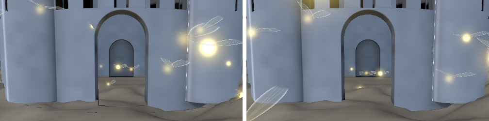
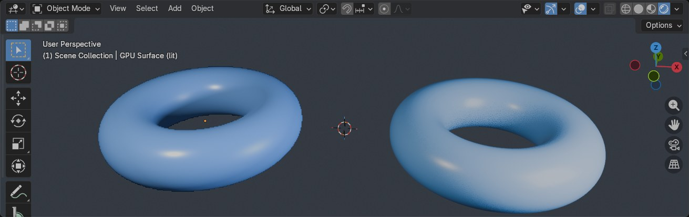

# GPU nodes

Code that runs on the graphics card, sitting in your Geometry Nodes tree like any other node.

Each code node is a node you write. The code says which inputs and outputs the node has. Wire code
nodes together (split streams, merge them, feed one function to many nodes) and CodeNodes compiles
every path into one GPU program, so splitting an effect into small nodes costs no speed.

Every node, with its complete code and every socket, is in [NODE_REFERENCE.md](NODE_REFERENCE.md).

**The principle: code runs on the GPU by default, and one node makes it geometry.** Every code node
runs and displays on the GPU, live in the viewport: particles, raymarched surfaces, mesh code. No
code node has a "display as mesh" option. The only way to get real Blender geometry is the
**To Geometry** node. Its header says what it outputs: **To Points** after particles, **To Mesh**
after a surface or mesh chain. Nothing adds one for you, not the Add menu and not the templates.
You put it where you want geometry.

## What you see

**Shift A › CodeNodes** in the Geometry Nodes editor offers:

| Node | What it does | Starters |
|---|---|---|
| **To Geometry** | Turns the GPU node or chain before it into real geometry | — |
| **Join Particles** | Merges two particle streams: the stages after it apply to both | — |
| **GPU Cache** | Bakes the GPU simulation passing through it and plays it back | — |
| **GPU Particles** | A particle source you write: `spawn(p)`, and optionally `update(p, dt)` | Galaxy, Flow, Attractor, Swirl, Fountain, Firefly Swarm, Spark Ball, Points from Function, Belt, Ring, Nebula |
| **GPU Surface (SDF)** | A shape from a distance function (`float sdf(vec3 p)`), raymarched | Castle, Planet, Saturn, Sun, Donut, Rounded Box, Gyroid Ball, Blob |
| **GPU Mesh** | Code run on every vertex of the mesh wired into it (`void deform(inout Vertex v)`) | Wave, Noise Displace, Mesa, Planet Terrain, Twist |
| **GPU Stage** | One step in a chain: what particles do, how they look, a warp, a mesh deform, or functions for other nodes | see below |
| **Code Shape** | A model built from a parametric description; real geometry straight away | Desk Lamp, Vase |

The GPU Stage starters, by section:
- **Particle stages** (what particles do): Wander, Rise, Gravity, Vortex, Drag, Blink, Push by Field,
  Collide with Shape, Gravity to Bodies, Collide with Bodies
- **Particle looks** (how they're drawn live): Glow Look, Firefly Look, Streak Look (trails),
  Material Look (a Blender material, lit by the scene), Star Colours (a `temp` attribute and its
  blackbody colour)
- **Warps** (particles and meshes alike): Bend, Taper, Follow Body (carries things along with a moving
  body)
- **Mesh stages**: Ripple, Sway by Field, Colour by Height
- **Functions** for other nodes: Wind Field, Orbits and Figure Eights (the same four outputs, so either
  can replace the other)
- **Lighting**: Scene Lights

3D View › Add › Mesh makes the same nodes on a new object.

## Writing a node: its sockets come from its code

```glsl
// Push by Field: a force from a function wired into 'field'
// @in  func  vec3 field(vec3 p)        a function input: wire a function in, then call field(p)
// @in  float amount 1.0 0.0 10.0       a slider (min and max are optional)
// @in  int   steps 2 1 8               a whole number
// @in  color tint 1.0 0.6 0.2          a colour
// @out attr  heat 0.0                  a per-particle value later nodes can read and write
// @out func  force                     your function `force` becomes an output socket
void behave(inout Particle p, float dt) {
  p.velocity += field(p.position) * amount * dt;
  p.heat = length(p.velocity);
}
vec3 force(vec3 q) { return -q * amount; }
```

That node gets these inputs: a Particles stream, `field` (a function socket), `amount`, `steps`,
`tint`. It gets these outputs: the Particles stream, `heat` (a field), and `force` (a function
socket). The sockets change as soon as you edit the code. `// @param name default min max` still
works: it means `@in float`.

**Which streams a node has** follows from the functions it defines:

| The code defines | The node | What it's for |
|---|---|---|
| `void spawn(inout Particle p)` | Particles out | a source: where particles are born |
| `void update(inout Particle p, float dt)` | (on a source) | the source moves its own particles; optional |
| `void born(inout Particle p)` | Particles in and out | runs once when a particle is (re)born, e.g. to set an attribute |
| `void behave(inout Particle p, float dt)` | Particles in and out | every step: change the velocity; the chain moves the particle |
| `vec4 look(Particle p)` | Particles in and out | how it's drawn live: colour and alpha |
| `vec3 warp(vec3 q)` | Particles **and** Mesh in and out | where things are *shown*: bends particles and meshes alike |
| `void deform(inout Vertex v)` | Mesh in and out | change each vertex of a mesh |
| `float sdf(vec3 p)` | an `sdf` function output | a GPU Surface; wire it into Collide with Shape |

**Functions can take anything**: ints, several arguments, or none. Orbits declares
`vec3 planetPos(int i, float t)`, `float planetRadius(int i)` and `int planetCount()`, and a node that
wants them writes `// @in func vec3 bodyPos(int i, float t)`. A function wired into another node is
included in that node's program once, with its own name prefix, however many nodes use it.

**Time:** `uTime` is the simulation's time in seconds; while the viewport previews a paused scene it
runs ahead of the timeline. `uSceneTime` is the timeline's time: it stays on the timeline's frame
during the preview. Use it for anything that must line up with real geometry. In the Galaxy scene the
planets are real meshes placed at `planetPos(i, uSceneTime)`, and the asteroids' gravity uses the same
time, so while you preview a paused scene the asteroids keep moving round planets that stay put.

**Declarations:**
- `@in float|int name default [min max]`: a slider or whole number.
- `@in color name r g b`: a colour socket (inside the code it's a `vec3`).
- `@in func RET name(ARGS) [= value]`: a function input. Wire another node's function output into
  it, then call it by name. With nothing wired in it returns zero, or the value after `=`.
- `@out func name`: one of your functions becomes an output socket.
- `@out attr name [default]`: a per-particle value. Up to four per chain. Every later node can read
  and write `p.name`. It's also a field output on the node, and To Geometry writes it as an
  attribute, so ordinary nodes can use it after conversion.
- `@shape point|glow|firefly`: how a Look node draws each particle.

**Names don't clash.** Each node's functions, constants and sliders get a per-node prefix, so two
nodes can both have a slider called `strength` or a helper called `hash()`. Attributes are the
exception: they're shared across the chain by name, on purpose. Compile errors name the node and the
line in the code you wrote (`node 'Wander', line 4: undefined variable "gravty"`).

## Chains and graphs

```
                                              ┌─> [Firefly Look]   heads   ┐  one GPU simulation,
[Firefly Swarm] -> [Wander] -> [Push by Field] -> [Blink]                   │  two looks
                                   ^ field    └─> [Streak Look]    trails  ┘
                              [Wind Field] ──> field of [Sway by Field] <- grass mesh -> To Mesh
[Spark Ball] ─┐
              ├─> [Join Particles] -> [Vortex] -> [Glow Look]
[Swirl] ──────┘
```

- **Particles** travel on Particles sockets (a Bundle socket, shown in its own colour). Per step, the
  source's `update` runs, then every stage's `behave` in the order they're wired; if the source has no
  `update`, the chain then moves each particle by its velocity. `born` runs after `spawn`. The last
  `look` decides how particles are drawn. Every `warp` runs in order where particles are shown and
  made real, never where they're simulated: straighten a Bend and the swirl is exactly as before.
- **Meshes** travel on ordinary Geometry sockets. A GPU Mesh node (or a stage with `deform` or `warp`
  wired straight to ordinary geometry) heads a mesh chain; each later stage's `deform` and `warp` run
  in order.
- **Functions** travel on Closure sockets. One function output can feed any number of nodes, in any
  chains of the same tree; each program includes it once, with its own prefix.





**How a graph is evaluated.** CodeNodes turns the graph into *pipelines*: every path from a source to
where a stream ends (a node nothing continues from, drawn live, or a node wired into To Geometry, made
real there). Each pipeline is one GPU program.

- **Branches.** An output wired into several stages splits the stream: each branch goes its own way.
  Branches that differ only in looks and warps **share one simulation** (the same source and born /
  behave stages, functions and attributes): the particles are stepped once and drawn once per
  branch. A branch with its own behaviour after the split runs its own copy of the simulation, which
  starts identical and then diverges. The first path keeps the source node's own object; each extra
  branch gets a hidden object in the CodeNodes Sources collection (named `source › last stage`).
- **Merging.** Join Particles takes two streams. Everything wired after it runs on both (each source
  keeps its own simulation), they're drawn together, and a To Geometry after it outputs both.
- **To Geometry partway along.** It outputs the stream as it is at that point; the rest of the chain
  still draws live.
- **Colours on the sockets:** Particles (bundle), Mesh or Geometry (geometry), functions (closure),
  attributes (float field). Blender won't wire a Particles output into a geometry input, so particles
  reach the rest of your tree only through To Geometry.

## A bigger graph: the Galaxy

The Galaxy scene (see the README, and `examples/galaxy_scene.py`) is built to show four things a single
chain can't:

| Idea | In the Solar System tree |
|---|---|
| **Reuse**: one node, several times, different inputs | three Planet Terrain + Colour by Height chains: a rocky, an ocean and an ice planet |
| **Sharing**: one output, many consumers | Orbits' `planetPos`, `planetRadius`, `planetMass`, `planetCount` feed Points from Function, Gravity to Bodies, Collide with Bodies and Follow Body |
| **Mixing**: GPU code and native nodes interleaved | Ico Sphere → Planet Terrain → Colour by Height → To Mesh → Set Material → Geometry to Instance → Instance on Points, on points placed by Points from Function |
| **Interaction**: systems affecting each other | the asteroid belt is pulled by the planets and bounces off them; the ring follows its planet |

Switch Orbits' Template to Figure Eights and the planets, the asteroids' gravity and collisions, and
the ring all follow the new paths (tests/test_galaxy.py checks each of these).



## Everything on the node

**Every socket has a tooltip.** Hover over it in the node editor. A code's own sliders take theirs from
the sentence in quotes at the end of their line, and the node's description is the code's first comment
line:

```glsl
// Wander: lazy curl-noise drifting, like insects on a summer evening.
// @in float calm 0.92 0.0 0.999  "How smoothly they turn: higher = lazier, smoother paths"
```



- **✎ Edit Code** (the first input) works as a button. Switch it on and the code opens in a pop-up
  Text Editor window; the toggle switches itself back off. Double-clicking a code node, or pressing
  Ctrl+E in the Node Editor, does the same. The node recompiles as you type.
- **Template** is a dropdown. Picking another loads that starter. If you had edited the code, your
  version is kept in a backup text named "… (before *template*)".
- **The code's own inputs** are sockets you can type into or wire up.
- **Settings** are inputs too, in closed panels: Count and Emit From on sources; Look (colour mode,
  colours, Glow, point size, brightness); Simulation (substeps, pre-warm, stagger); Bounds for surfaces.
- **The header** shows the status: `Galaxy · live · 1.0M`, `Wander · in chain`, `Castle · real`, or
  `⚠` and the error.
- **Tab into the node** and one frame shows the code, another the full status or error.

**To Geometry's inputs:**
- **Particles** (after a particle chain) or **Geometry** (after a surface or mesh chain): the input
  follows what's wired into it.
- **When**, a dropdown:
  - Automatic: every frame for particles and code that reads the time; when something changes
    otherwise
  - Every Frame
  - When Changed
  - Only for Render: stays live in the viewport, and is converted for renders (F12, Ctrl+F12)
- **Resolution** for surfaces, or **Max Points** for particles.
- **Keep Velocity** and **Keep Age** pick which particle attributes to write. The chain's own
  attributes (`brightness`, `phase`, …) are always written.

Its header says what it outputs and what that costs, for example `To Points · 5 ms` or
`To Mesh · 210 ms`. It used to be called Make Real; older files are renamed when they open.

## Paused, but still moving

Behaviour nodes (Wander, Rise, Vortex, Drag, …) change how particles *move*, so with the timeline
stopped their sliders would show nothing. While playback is paused, the viewport keeps its own clock
running: live particle chains (and surfaces or mesh code set to Animate) keep simulating, so a slider
you drag shows its effect straight away. Dragging Wander's strength from 0.5 to 4 took the particles'
median speed from 0.53 to 2.0 m/s within 0.6 s (tests/test_live_preview.py).

- The scene frame doesn't change. The preview runs its own copy of each simulation, so renders,
  To Geometry and the GPU Cache always use the real frame.
- Playing the timeline takes over from the preview; changing the frame restarts the preview there.
- It stops when nothing is drawing (Blender minimised) and while rendering.
- Switch it off in Preferences › Add-ons › CodeNodes › "Keep simulating in the viewport while paused".

## Live, and converted

| | A GPU chain on its own | With To Geometry after it |
|---|---|---|
| Shown by | Drawn straight from GPU memory into the 3D viewport, depth-tested against your objects: points, glowing sprites, or fireflies with flapping wings | Real points (`velocity`, `speed`, `age`, `life`, and the chain's attributes) or a real mesh (with `color` and `value` from GPU Mesh) |
| Speed | 1M particles at about 190 fps; the five-node firefly chain at about 150; a bent galaxy at about 140 (RTX A4500) | What copying into Blender costs: 2,500 fireflies in about 5 ms; the Castle at resolution 192 in about 210 ms |
| Selectable, visible to later nodes, Blender's F12 | No: a viewport picture | Yes, like after Realize Instances |

**Where live surfaces meet meshes:** a surface is marched at Live Resolution and scaled up, with its
depth read unfiltered, so it meets Blender's own objects without a dark fringe (left: before 0.4.1,
right: now).



**Where a mesh chain gets its mesh:** Blender can't hand a node's incoming geometry to Python. So
CodeNodes keeps a hidden "tap": an object whose Geometry Nodes are a trimmed copy of your tree,
ending at the chain's Mesh input. It's kept in step with your tree automatically.

**The helpers are out of the way:** the objects behind code nodes (and taps) live in the "CodeNodes
Sources" collection, which is excluded from the view layer. Object Info still reads them.

## Rendering

The GPU must never run while Blender's renderer works: that crashes Blender. So:

1. **F12, Ctrl+F12 and Render › Render Image / Render Animation**, when the scene has GPU code nodes.
   For each frame, on Blender's main thread:
   1. Step every GPU chain to that frame.
   2. Convert it. Chains without To Geometry (or set to Only for Render) are converted just for the
      render, then go back to live.
   3. Render that one frame and wait for it.

   The GPU and the renderer take turns, so no bake is needed. A still lands in the Render window. An
   animation is written to the output path in the output format; a movie format is written by
   rendering the frames, then encoding them with Blender's own movie writer. The tests press the real
   keys (tests/test_render_f12.py) and count GPU work during rendering: it stays at 0.
   - How: CodeNodes adds F12 and Ctrl+F12 to the Screen key map and takes the Render menu's first two
     items, calling `codenodes.render_auto`. A scene without GPU nodes, or the preference "F12 and Render
     menu include GPU nodes" switched off, gets Blender's own render.
   - Why not a render handler: Blender runs render_init, and frame_change_pre during an animation render,
     on the render job's thread, where GPU work crashes.
   - Not covered: `bpy.ops.render.render()` called directly by a script in a window. It renders what is
     real (To Geometry results, bakes). Use `bpy.ops.codenodes.render()` in a script.
2. **The Rendered viewport** (EEVEE or Cycles) keeps drawing the live GPU nodes over the render.
   CodeNodes refuses all GPU work while any final render runs.

The live glow is a viewport drawing, so a render gets what your nodes build from the converted
points. The demo places a small firefly model on each point, flaps its wings from `phase` and the
time, lights its abdomen from `brightness`, and adds bloom in the compositor.

**Command-line and farm renders** (`blender -b scene.blend -a`, or `-f N`) need **Blender 5.2 or later**,
whose `gpu.init()` gives background mode the GPU, and CodeNodes enabled in that Blender. Nothing else to
do: when the render starts, CodeNodes steps every frame of the range on the GPU, makes it real and keeps it
as a mesh, then swaps each frame's meshes in as Blender renders it. (It has to be done up front: once the
first frame has rendered, Python can't use the GPU again until the render ends; measured on 5.2.2.) A
script can also call `bpy.ops.codenodes.render(animation=True)`, which takes turns frame by frame as F12
does. tests/test_cli_render.py renders a scene both ways in separate `blender -b` processes and checks the
frames are identical. Before 5.2, background Blender has no GPU for add-ons: bake first, and the farm
renders the bake.

## Baking

- **Blender's Bake node after To Geometry** works like on any geometry: bake a range (Animation
  mode), scrub it, render it with F12, with the code nodes switched off or the add-on gone. CodeNodes
  converts each frame before Blender evaluates it (a frame_change_pre handler), which is what the
  Bake node captures. In a script, refresh the object (`obj.update_tag()`) after baking; Blender's UI
  does that itself.
- **GPU Cache** bakes a live simulation itself, before any To Geometry:
  - **Mode**: Live (simulate on the GPU every frame) or Cached (play the baked frames).
  - **Start / End**: the frames to bake. Outside them, the nearest baked frame shows.
  - **⟳ Bake Now** and **✕ Clear** are toggles that act as buttons.
  - The header says what's there: `Cached 1–48 · 13.0 MB`.
  - What's cached is the simulation of every pipeline passing through the node (its source and
    born/behave stages); looks and warps after it stay live, so you can restyle a cached simulation.
  - Cached frames play back when scrubbing, feed To Geometry and Render with CodeNodes, and are stored
    next to the .blend in `codenodes_cache/<source>/` (until the file is saved, in Blender's temp folder).
  - The format is per frame: position, velocity, age, life and each attribute as 16-bit floats,
    zlib-compressed. Measured: 20,000 particles × 48 frames = 13.0 MB (14.25 bytes per particle per
    frame), baked in under a second; positions within 1 mm of the live simulation.

## Lighting

- **Scene Lights** (Add › CodeNodes › Lighting) turns the scene's lamps (sun, point, spot, area, up to
  8, brightest first) and world colour into a function, `light(p, n, v, albedo, roughness, metallic)`:
  Lambert diffuse and GGX specular, the main lobes of Principled BSDF, with each lamp's size widening
  its highlight as EEVEE's soft lamps do. The light data are hidden inputs CodeNodes keeps in step with
  the scene (move a lamp and the light moves; nothing recompiles), in the space of the object whose
  tree holds the node. Its inputs: intensity and world.
- **Material Look** takes a Blender material (a Material socket) and brings in its Principled BSDF
  values: base colour, roughness, metallic, emission (colour × strength), alpha. Wire Scene Lights'
  `light` into it and particles are shaded by the scene's lamps; wire its `material` output into a GPU
  Surface.
- **GPU Surfaces** have **Lights** and **Material** inputs. With Scene Lights and a Material Look wired
  in, the raymarched surface is lit by the scene's lamps with that material (soft self-shadows for the
  two brightest lamps) instead of its built-in sun and sky. Side by side with the same surface made
  real and lit by EEVEE, the two look close:

  
- **Any node can declare** `// @in material mat` (a Material socket; its values arrive as `mat_base`,
  `mat_roughness`, `mat_metallic`, `mat_emit`, `mat_alpha`) and `// @in hidden name` (a value the
  add-on fills in, with no socket).

## Feeding it from Geometry Nodes

- **Values:** a typed value, a Value or Integer node, a reroute, or the modifier's own input.
  A value computed by other nodes (Math, Scene Time, ...) is evaluated onto one point by a hidden helper
  object and read back each sync; renders refresh it for every frame. A field is read at the origin.
- **Geometry for particles:** the source's **Emit From** object input. CodeNodes reads that object's
  evaluated geometry (points, or a surface sampled evenly by area), including what its own Geometry
  Nodes make, and re-reads it when the object changes. Use `emitPoint(seed)` and `emitNormal(seed)`
  in `spawn`.
- **Geometry for mesh chains:** anything wired into the first node's Mesh input, through the tap.

## Starter library: proposals to choose from

Only the starters the demos need are built (since 0.4 also Streak Look, Material Look, Sway by Field
and Scene Lights). Here are proposals for the rest, particles and meshes separately, for you to pick
from:

**Particles**
- Sources: Emit from Curve, Burst (all at once, on a trigger frame), Grid, Inside Volume
  (fill an SDF), From Points (one particle per point of a Geometry Nodes point cloud)
- Behaviours: Attract to Point, Orbit, Flock (align, cohere, separate, via a spatial hash), Turbulence
  (fBm), Collide with Ground, Stick to Surface, Age-based Colour, Size over Life, Kill Outside Bounds,
  Follow Curve, Springs to Rest Position (for jiggly "made of particles" objects)
- Looks: Trails (fading history, beyond Streak Look's motion streak), Sparks, Smoke Puff (soft,
  growing, fading), Dust Motes (depth-of-field-like softness), Colour Ramp by Speed
- Effects on the whole system: Bloom Strength, Density Tint, Fade by Distance

**Meshes**
- Deformers: Wave, Noise Displace, Twist, Bend, Taper, Inflate, Melt (gravity sag), Explode (pieces fly
  by face), Shrinkwrap to SDF, Lattice-like Cage
- Colour and data: Curvature, Ambient Occlusion (GPU), Height Gradient, Distance to Point, Vertex Noise
  Colour
- Fields for other nodes: Wind, Vortex Field, SDF Primitives (sphere, box, capsule) as function outputs

## Blender versions

Blender 5.0.1, 5.1.2 and 5.2.2 all have what this needs: compute shaders, image load/store, Menu, Bundle
and Closure sockets, and frames that show text. The same tests run on all three.

5.2 changed two things CodeNodes deals with:
- **Modifier inputs** moved from ID properties (`mod["Socket_2"]`) to RNA
  (`mod.properties.inputs.Socket_2.value`). `codenodes/mod_inputs.py` takes the old keys on every version.
- **Typed nodes** (Compare, Random Value, Switch...) show only the current type's sockets, named without
  the type, so `B_INT` is now `B`. Saved node descriptions still load: a missing typed identifier falls
  back to the plain one.

5.2 also gives background mode the GPU (`gpu.init()`), so most GPU test suites and command-line renders
run without a window (`tests/headless.py`, `tools/testing/run_all_linux.sh`).

## Limits, honestly

- **Live results are an overlay until converted:** not selectable, not in a direct `bpy.ops.render.render()`, not
  visible to later nodes.
- **Branches made real run their own simulation:** live branches share their head's simulation, but
  a branch that To Geometry converts steps its own copy (the same particles, computed again).
- **Join Particles** is for particles; meshes merge with an ordinary Join Geometry after To Mesh.
- **GPU Cache** caches particle simulations; surfaces and mesh chains bake with Blender's Bake node
  after To Geometry.
- **Additive glow isn't tone-mapped** in the Solid viewport: where very many glowing particles pile
  up (a galaxy's core, a fold in a bent galaxy) it can clip to white. Lower Brightness, or use fewer,
  larger particles.
- **Attributes:** up to four per-particle attributes per chain.
- **Glow isn't lighting:** the live glow and halo are drawn, not lit. They don't light your objects,
  and a render gets the look you build from the converted points.
- **Lighting between GPU nodes and Blender objects:** no shadows either way. A GPU Surface without
  Scene Lights lights itself (a sun from the scene's first Sun lamp, sky, soft shadows, ambient
  occlusion, fog). Scene Lights reads lamps in the space of the first object using the tree; lamp
  textures, IES, light linking and material nodes beyond the Principled BSDF's own values are ignored.
  Particles lit by a Material Look are shaded as small spheres facing the camera.
- **Taps and modifiers:** a mesh chain follows your tree through its tap, so a modifier stacked
  before the Geometry Nodes modifier isn't seen.
- **Tested hardware:** NVIDIA with OpenGL only. AMD, Intel, macOS and the Vulkan backend are untested.
  The shaders keep push constants within the 128 bytes Vulkan guarantees.
